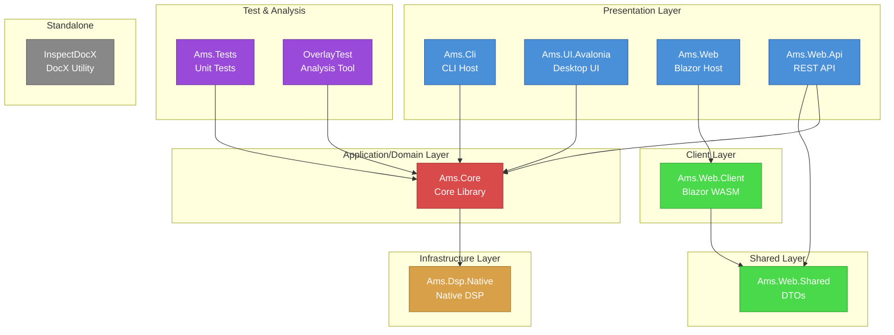

# Module Dependency Diagram

Generated: 2025-12-28

## Project Dependency Graph (Mermaid)



## Simplified Dependency Flow

```
┌─────────────────────────────────────────────────────────────────────────────┐
│                           PRESENTATION LAYER                                │
│  ┌─────────────┐  ┌─────────────┐  ┌─────────────┐  ┌─────────────────────┐ │
│  │   Ams.Cli   │  │ Ams.UI.     │  │ Ams.Web.Api │  │     Ams.Web         │ │
│  │  (CLI Host) │  │  Avalonia   │  │ (REST API)  │  │  (Blazor Server)    │ │
│  └──────┬──────┘  └──────┬──────┘  └──────┬──────┘  └──────────┬──────────┘ │
│         │                │                │                     │           │
└─────────┼────────────────┼────────────────┼─────────────────────┼───────────┘
          │                │                │                     │
          │                │                │         ┌───────────▼───────────┐
          │                │                │         │   Ams.Web.Client      │
          │                │                │         │   (Blazor WASM)       │
          │                │                │         └───────────┬───────────┘
          │                │                │                     │
          │                │                ├─────────────────────┤
          │                │                │                     │
          ▼                ▼                ▼                     ▼
┌─────────────────────────────────────────────────────────────────────────────┐
│                        APPLICATION/DOMAIN LAYER                             │
│                                                                             │
│  ┌─────────────────────────────────────────┐    ┌─────────────────────────┐ │
│  │               Ams.Core                  │    │    Ams.Web.Shared       │ │
│  │                                         │    │       (DTOs)            │ │
│  │  - Application Commands                 │    └─────────────────────────┘ │
│  │  - Pipeline Services                    │                                │
│  │  - ASR/MFA Integration                  │                                │
│  │  - Audio Processing                     │                                │
│  │  - Document Processing                  │                                │
│  └───────────────────┬─────────────────────┘                                │
│                      │                                                      │
└──────────────────────┼──────────────────────────────────────────────────────┘
                       │
                       ▼
┌─────────────────────────────────────────────────────────────────────────────┐
│                         INFRASTRUCTURE LAYER                                │
│  ┌─────────────────────────────────────────┐                                │
│  │           Ams.Dsp.Native                │                                │
│  │         (Native DSP Code)               │                                │
│  └─────────────────────────────────────────┘                                │
│                                                                             │
│  External Tools (bundled):                                                  │
│  - FFmpeg binaries (avcodec, avformat, etc.)                                │
│  - Plugalyzer.exe (VST analyzer)                                            │
│  - Whisper CUDA runtime                                                     │
└─────────────────────────────────────────────────────────────────────────────┘
```

## Layer Analysis

### Layer 1: Presentation (Hosts)

| Project | Type | Purpose |
|---------|------|---------|
| Ams.Cli | Console App | Primary CLI interface for pipeline operations |
| Ams.UI.Avalonia | Desktop App | Cross-platform desktop UI |
| Ams.Web.Api | Web API | REST endpoints for web client |
| Ams.Web | Blazor Server | Hosts the Blazor WASM client |

**Observations:**
- All hosts depend directly on Ams.Core
- No inter-host dependencies (good isolation)
- Each host can evolve independently

### Layer 2: Application/Domain (Core)

| Project | Type | Purpose |
|---------|------|---------|
| Ams.Core | Class Library | Central business logic and pipeline |
| Ams.Web.Shared | Class Library | Web DTOs (isolated from Core) |

**Observations:**
- Ams.Core is the **dependency hub** - all functionality flows through it
- Ams.Web.Shared is properly isolated (no Core dependency)
- Good separation between web contracts and domain

### Layer 3: Infrastructure (Native)

| Project | Type | Purpose |
|---------|------|---------|
| Ams.Dsp.Native | Class Library | Low-level DSP operations |

**Observations:**
- Leaf node with zero dependencies
- Contains unsafe/native code
- Only Ams.Core depends on it

## Dependency Health Assessment

### Positive Patterns

1. **Acyclic Graph** - No circular dependencies detected
2. **Clear Layering** - Presentation -> Core -> Native follows clean architecture
3. **Host Isolation** - Hosts don't depend on each other
4. **Web Tier Separation** - Web.Client uses Web.Shared, not Core directly

### Concerns

1. **Core is Monolithic** - 14+ external packages, handles audio, documents, OCR, logging
2. **No Abstraction Layer** - Hosts depend directly on concrete Core, not interfaces
3. **Mixed Concerns in Core** - Both domain logic and infrastructure (FFmpeg, Whisper) in same project
4. **Package Version Drift** - Serilog packages have different versions between Core and CLI

### Dependency Metrics

| Metric | Value |
|--------|-------|
| Total Projects | 11 |
| Max Depth | 3 (CLI -> Core -> DSP.Native) |
| Leaf Nodes | 3 (DSP.Native, Web.Shared, InspectDocX) |
| Hub Projects | 1 (Ams.Core with 6 dependents) |
| Isolated Projects | 1 (InspectDocX) |

## Core Pipeline Path

The primary audio processing pipeline follows this dependency chain:

```
Ams.Cli (host)
    │
    ▼
Ams.Core (orchestration)
    │
    ├──► Application.Commands (GenerateTranscript, ComputeAnchors, etc.)
    │
    ├──► Application.Services (PipelineService, ValidationService)
    │
    ├──► Services.Integrations (FFmpeg, Nemo ASR, MFA)
    │
    └──► Ams.Dsp.Native (signal processing)
```

## Recommendations for Phase 2

1. **Map internal Core structure** - Core is too large; understand its internal layering
2. **Identify extraction candidates** - Infrastructure code (FFmpeg, Whisper) could be separate projects
3. **Review package consolidation** - Reconcile version differences between projects
4. **Consider interface layer** - Abstracting Core would enable better testability
