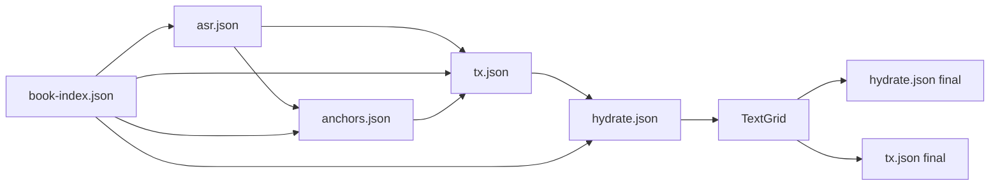

# Pipeline Artifacts

This document catalogues all files produced by the AMS pipeline, including naming conventions, content structure, and when each artifact is created.

## Artifact Inventory

### Summary Table

| Artifact | Stage | Pattern | Format | Description |
|----------|-------|---------|--------|-------------|
| Book Index | BookIndex | `book-index.json` | JSON | Parsed book structure |
| ASR Response | ASR | `{chapter}.asr.json` | JSON | Token timings from ASR |
| ASR Corpus | ASR | `{chapter}.asr.corpus.txt` | Plain text | Transcription for MFA |
| Anchors | Anchors | `{chapter}.align.anchors.json` | JSON | Sync points |
| Transcript Index | Transcript | `{chapter}.align.tx.json` | JSON | Word alignments |
| Hydrated Transcript | Hydrate | `{chapter}.align.hydrate.json` | JSON | Enriched transcript |
| TextGrid | MFA | `alignment/mfa/{chapter}.TextGrid` | Praat TextGrid | Word/phone boundaries |
| Treated Audio | Post-MFA | `{chapter}.treated.wav` | WAV | Copy of source audio |

## Per-Stage Artifact Production

### Stage 1: Book Index

**Location:** `{book-root}/book-index.json`

**Created by:** `PipelineService.EnsureBookIndexAsync()` → `DocumentProcessor.BuildBookIndexAsync()`

**Content Structure:**
```json
{
  "sourceFile": "C:/Books/MyBook.md",
  "sourceFileHash": "sha256:abc123...",
  "indexedAt": "2025-01-15T10:30:00Z",
  "title": "My Book Title",
  "author": "Author Name",
  "totals": {
    "words": 50000,
    "sentences": 2500,
    "paragraphs": 500,
    "estimatedDurationSec": 15000.0
  },
  "words": [
    { "text": "Chapter", "wordIndex": 0, "sentenceIndex": 0, "paragraphIndex": 0, "sectionIndex": 0 },
    { "text": "One", "wordIndex": 1, "sentenceIndex": 0, "paragraphIndex": 0, "sectionIndex": 0 }
  ],
  "sentences": [
    { "index": 0, "start": 0, "end": 15 }
  ],
  "paragraphs": [
    { "index": 0, "start": 0, "end": 50, "kind": "heading", "style": "Heading 1" }
  ],
  "sections": [
    { "id": 0, "title": "Chapter One", "level": 1, "kind": "chapter", "startWord": 0, "endWord": 500, "startParagraph": 0, "endParagraph": 10 }
  ]
}
```

**Key Fields:**
- `words[]`: Every word with positional indices
- `sections[]`: Chapter boundaries (for per-chapter processing)
- `sourceFileHash`: Cache invalidation key

---

### Stage 2: ASR

**Location:** `{chapter-root}/{chapter}.asr.json`

**Created by:** `GenerateTranscriptCommand.ExecuteAsync()` → `AsrService.TranscribeAsync()` or `AsrClient.TranscribeAsync()`

**Content Structure:**
```json
{
  "modelVersion": "nemo-parakeet-tdt-ctc-0.6.1",
  "tokens": [
    { "t": 0.5, "d": 0.3, "w": "chapter" },
    { "t": 0.85, "d": 0.25, "w": "one" }
  ],
  "segments": []
}
```

**Key Fields:**
- `tokens[].t`: Start time in seconds
- `tokens[].d`: Duration in seconds
- `tokens[].w`: Recognized word
- `modelVersion`: Identifies ASR model used

**Additional Artifact:** `{chapter}.asr.corpus.txt`

**Content:** Plain text transcription (whitespace-separated words)
```
chapter one the beginning of our story
```

**Purpose:** Input for MFA forced alignment

---

### Stage 3: Anchors

**Location:** `{chapter-root}/{chapter}.align.anchors.json`

**Created by:** `ComputeAnchorsCommand.ExecuteAsync()` → `AlignmentService.ComputeAnchorsAsync()`

**Content Structure:**
```json
{
  "sectionDetected": true,
  "section": {
    "Id": 1,
    "Title": "Chapter One",
    "Level": 1,
    "Kind": "chapter",
    "StartWord": 0,
    "EndWord": 500
  },
  "policy": {
    "ngram": 3,
    "targetPerTokens": 50,
    "minSeparation": 100,
    "disallowBoundaryCross": false,
    "stopwords": "domain"
  },
  "tokens": {
    "bookCount": 500,
    "bookFilteredCount": 450,
    "asrCount": 480,
    "asrFilteredCount": 430
  },
  "window": {
    "bookStart": 0,
    "bookEnd": 500
  },
  "anchors": [
    { "bp": 0, "bpWordIndex": 0, "ap": 0 },
    { "bp": 50, "bpWordIndex": 50, "ap": 48 }
  ],
  "windows": [
    { "bLo": 0, "bHi": 50, "aLo": 0, "aHi": 48 }
  ]
}
```

**Key Fields:**
- `anchors[]`: Sync points between book (bp) and ASR (ap) positions
- `windows[]`: Alignment windows between anchor points
- `policy`: NGram and separation settings used

---

### Stage 4: Transcript Index

**Location:** `{chapter-root}/{chapter}.align.tx.json`

**Created by:** `BuildTranscriptIndexCommand.ExecuteAsync()` → `AlignmentService.BuildTranscriptIndexAsync()`

**Content Structure:**
```json
{
  "audioPath": "C:/Audio/Chapter01.wav",
  "scriptPath": "C:/Work/Chapter01.asr.json",
  "bookIndexPath": "C:/Work/book-index.json",
  "createdAtUtc": "2025-01-15T11:00:00Z",
  "normalizationVersion": "1.0",
  "words": [
    { "bookIdx": 0, "asrIdx": 0, "op": "Match", "reason": "exact", "score": 1.0 },
    { "bookIdx": 1, "asrIdx": null, "op": "Del", "reason": "missing in ASR", "score": 0.0 }
  ],
  "sentences": [
    {
      "id": 0,
      "bookRange": { "start": 0, "end": 15 },
      "scriptRange": { "start": 0, "end": 14 },
      "timing": { "start": 0.5, "end": 4.2 },
      "metrics": { "wer": 0.05, "cer": 0.02, "spanWer": 0.03, "missingRuns": 0, "extraRuns": 0 },
      "status": "ok"
    }
  ],
  "paragraphs": [
    {
      "id": 0,
      "bookRange": { "start": 0, "end": 50 },
      "sentenceIds": [0, 1, 2],
      "metrics": { "wer": 0.05, "cer": 0.02, "coverage": 0.95 },
      "status": "ok"
    }
  ]
}
```

**Key Fields:**
- `words[]`: Word-level alignment operations (Match/Sub/Ins/Del)
- `sentences[].timing`: Initial timing from ASR (updated by MFA merge)
- `sentences[].metrics`: WER/CER quality metrics

---

### Stage 5: Hydrated Transcript

**Location:** `{chapter-root}/{chapter}.align.hydrate.json`

**Created by:** `HydrateTranscriptCommand.ExecuteAsync()` → `AlignmentService.HydrateTranscriptAsync()`

**Content Structure:**
```json
{
  "audioPath": "C:/Audio/Chapter01.wav",
  "scriptPath": "C:/Work/Chapter01.asr.json",
  "bookIndexPath": "C:/Work/book-index.json",
  "createdAtUtc": "2025-01-15T11:30:00Z",
  "normalizationVersion": "1.0",
  "words": [
    {
      "bookIdx": 0,
      "asrIdx": 0,
      "bookWord": "Chapter",
      "asrWord": "chapter",
      "op": "Match",
      "reason": "case-insensitive match",
      "score": 1.0,
      "startSec": 0.5,
      "endSec": 0.8,
      "durationSec": 0.3
    }
  ],
  "sentences": [
    {
      "id": 0,
      "bookRange": { "start": 0, "end": 15 },
      "scriptRange": { "start": 0, "end": 14 },
      "bookText": "Chapter One: The Beginning",
      "scriptText": "chapter one the beginning",
      "metrics": { "wer": 0.05, "cer": 0.02, "spanWer": 0.03, "missingRuns": 0, "extraRuns": 0 },
      "status": "ok",
      "timing": { "start": 0.5, "end": 4.2 },
      "diff": {
        "ops": [
          { "op": "equal", "tokens": ["chapter", "one", "the", "beginning"] }
        ],
        "stats": { "referenceTokens": 4, "hypothesisTokens": 4, "matches": 4, "insertions": 0, "deletions": 0 }
      }
    }
  ],
  "paragraphs": [
    {
      "id": 0,
      "bookRange": { "start": 0, "end": 50 },
      "sentenceIds": [0, 1, 2],
      "bookText": "Chapter One: The Beginning...",
      "metrics": { "wer": 0.05, "cer": 0.02, "coverage": 0.95 },
      "status": "ok",
      "diff": null
    }
  ]
}
```

**Key Fields:**
- `words[].bookWord/asrWord`: Both original and recognized text
- `words[].startSec/endSec`: Timing (null initially, filled by MFA merge)
- `sentences[].bookText/scriptText`: Full sentence text comparison
- `sentences[].diff`: Token-level diff for debugging

---

### Stage 6: MFA TextGrid

**Location:** `{chapter-root}/alignment/mfa/{chapter}.TextGrid`

**Created by:** `RunMfaCommand.ExecuteAsync()` → `MfaWorkflow.RunChapterAsync()`

**Format:** Praat TextGrid (plain text, not JSON)

**Content Structure:**
```
File type = "ooTextFile"
Object class = "TextGrid"

xmin = 0
xmax = 300.5
tiers? <exists>
size = 2

item [1]:
    class = "IntervalTier"
    name = "words"
    xmin = 0
    xmax = 300.5
    intervals: size = 150
    intervals [1]:
        xmin = 0
        xmax = 0.5
        text = ""
    intervals [2]:
        xmin = 0.5
        xmax = 0.8
        text = "chapter"
    intervals [3]:
        xmin = 0.8
        xmax = 1.05
        text = "one"
```

**Key Elements:**
- `words` tier: Word boundaries with start/end times
- Empty `text = ""`: Silence/pause intervals
- `xmin/xmax`: Precise timing in seconds

**Parsed as:** `TextGridDocument` with `TextGridInterval` list

---

### Stage 7: Treated Audio

**Location:** `{chapter-root}/{chapter}.treated.wav`

**Created by:** `PipelineService.CopyTreatedAudio()`

**Content:** Direct copy of source audio file

**Purpose:** Staging area for downstream processing (future audio treatment)

---

## Additional Artifacts (Not Pipeline Stages)

### Pause Policy

**Location:** `{chapter-root}/pause-policy.json` or `{book-root}/pause-policy.json`

**Content:** Pause insertion rules for TTS/mastering

```json
{
  "version": "1.0",
  "rules": [
    { "punctuation": ".", "pauseMs": 500 },
    { "punctuation": ",", "pauseMs": 200 }
  ]
}
```

### Pause Adjustments

**Location:** `{chapter-root}/{chapter}.pause-adjustments.json`

**Content:** Manual timing overrides

---

## File Naming Conventions

### Chapter Artifacts

Pattern: `{chapter-id}.{artifact-type}.{format}`

| Artifact Type | Pattern | Example |
|---------------|---------|---------|
| ASR | `{id}.asr.json` | `Chapter01.asr.json` |
| ASR Corpus | `{id}.asr.corpus.txt` | `Chapter01.asr.corpus.txt` |
| Anchors | `{id}.align.anchors.json` | `Chapter01.align.anchors.json` |
| Transcript | `{id}.align.tx.json` | `Chapter01.align.tx.json` |
| Hydrate | `{id}.align.hydrate.json` | `Chapter01.align.hydrate.json` |
| TextGrid | `alignment/mfa/{id}.TextGrid` | `alignment/mfa/Chapter01.TextGrid` |
| Treated | `{id}.treated.wav` | `Chapter01.treated.wav` |

### Artifact Resolution

```csharp
// FileArtifactResolver patterns
GetChapterArtifactPath(context, suffix)
    → {chapterRoot}/{chapterId}.{suffix}

GetTextGridPath(context)
    → {chapterRoot}/alignment/mfa/{chapterId}.TextGrid
```

## Directory Structure

```
{book-root}/
├── book-index.json              # Book structure (shared)
├── pause-policy.json            # Optional book-level policy
│
└── {chapter-id}/                # Per-chapter directory
    ├── {chapter-id}.asr.json
    ├── {chapter-id}.asr.corpus.txt
    ├── {chapter-id}.align.anchors.json
    ├── {chapter-id}.align.tx.json
    ├── {chapter-id}.align.hydrate.json
    ├── {chapter-id}.treated.wav
    ├── pause-policy.json        # Optional chapter-level policy
    │
    └── alignment/
        └── mfa/
            ├── {chapter-id}.TextGrid
            └── (other MFA artifacts)
```

## Artifact Dependencies



## Artifact Lifecycle

| Artifact | Created | Updated | Read By |
|----------|---------|---------|---------|
| book-index.json | BookIndex stage | Never (immutable) | All stages |
| asr.json | ASR stage | Never | Anchors, Transcript |
| asr.corpus.txt | ASR stage | Never | MFA |
| anchors.json | Anchors stage | Never | Transcript |
| tx.json | Transcript stage | Merge stage (timing) | Hydrate, Merge |
| hydrate.json | Hydrate stage | Merge stage (timing) | MFA, Merge |
| TextGrid | MFA stage | Never | Merge |
| treated.wav | Post-MFA | Never | Downstream |
