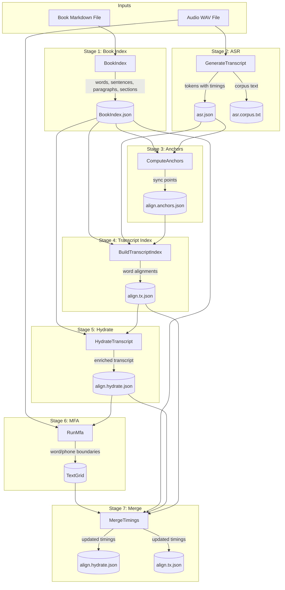
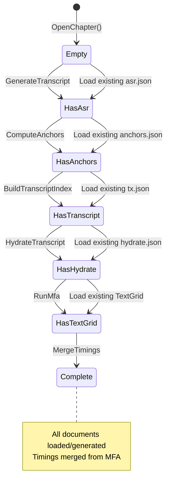

# Pipeline Data Flow

This document describes the data transformations and types that flow through each pipeline stage.

## Overview

The AMS pipeline transforms audio and book text into word-level timing data through a series of stages. Each stage produces structured documents that are consumed by subsequent stages.

## Data Flow Diagram



## Per-Stage Data Types

### Stage 1: Book Index

**Command:** `EnsureBookIndexAsync` (internal to PipelineService)

| Direction | Type | Description |
|-----------|------|-------------|
| **Input** | `FileInfo` | Book markdown file path |
| **Output** | `BookIndex` | Structured representation of book content |

**BookIndex Record:**
```csharp
record BookIndex(
    string SourceFile,           // Path to source markdown
    string SourceFileHash,       // Hash for cache invalidation
    DateTime IndexedAt,          // When index was built
    string? Title,               // Book title (from frontmatter)
    string? Author,              // Book author (from frontmatter)
    BookTotals Totals,           // Word/sentence/paragraph counts
    BookWord[] Words,            // All words with positions
    SentenceRange[] Sentences,   // Sentence boundaries
    ParagraphRange[] Paragraphs, // Paragraph boundaries
    SectionRange[] Sections      // Chapter/section boundaries
);
```

**BookWord Record:**
```csharp
record BookWord(
    string Text,            // Exact word text
    int WordIndex,          // Global word position (0-based)
    int SentenceIndex,      // Which sentence contains this word
    int ParagraphIndex,     // Which paragraph contains this word
    int SectionIndex = -1,  // Which section/chapter (-1 if none)
    string[]? Phonemes = null  // Optional G2P phonemes
);
```

### Stage 2: ASR (Automatic Speech Recognition)

**Command:** `GenerateTranscriptCommand`

| Direction | Type | Description |
|-----------|------|-------------|
| **Input** | Audio buffer (from chapter) | PCM audio data |
| **Input** | `GenerateTranscriptOptions` | Engine config (Nemo/Whisper) |
| **Output** | `AsrResponse` | Token timings from speech recognition |
| **Output** | `string` (corpus text) | Plain text transcription |

**AsrResponse Record:**
```csharp
record AsrResponse(
    string ModelVersion,    // ASR model identifier
    AsrToken[] Tokens,      // Word tokens with timing
    AsrSegment[] Segments   // Segment-level text (fallback)
);

record AsrToken(
    double StartTime,   // "t" - start time in seconds
    double Duration,    // "d" - duration in seconds
    string Word         // "w" - recognized word
);
```

**Transformation:**
- Audio → ASR Service (Nemo HTTP API or Whisper.NET) → Token sequence
- Side effect: Corpus text file written for MFA input

### Stage 3: Anchors

**Command:** `ComputeAnchorsCommand`

| Direction | Type | Description |
|-----------|------|-------------|
| **Input** | `BookIndex` (via chapter.Book) | Book word list |
| **Input** | `AsrResponse` (via chapter.Documents) | ASR tokens |
| **Input** | `AnchorComputationOptions` | NGram settings, separation |
| **Output** | `AnchorDocument` | Sync points between book and ASR |

**AnchorDocument Record:**
```csharp
record AnchorDocument(
    bool SectionDetected,                    // Auto-detected chapter?
    AnchorDocumentSection? Section,          // Section boundaries
    AnchorDocumentPolicy Policy,             // NGram/separation settings
    AnchorDocumentTokenStats Tokens,         // Token counts
    AnchorDocumentWindow Window,             // Book word range
    IReadOnlyList<AnchorDocumentAnchor> Anchors,  // Sync points
    IReadOnlyList<AnchorDocumentWindowSegment>? Windows  // Alignment windows
);

record AnchorDocumentAnchor(
    int BookPosition,      // "bp" - book word position
    int BookWordIndex,     // "bpWordIndex" - word index
    int AsrPosition        // "ap" - ASR token position
);
```

**Transformation:**
- Book words × ASR tokens → NGram matching → Anchor points
- Purpose: Identify reliable sync points for alignment

### Stage 4: Transcript Index

**Command:** `BuildTranscriptIndexCommand`

| Direction | Type | Description |
|-----------|------|-------------|
| **Input** | `BookIndex` | Book structure |
| **Input** | `AsrResponse` | ASR tokens |
| **Input** | `AnchorDocument` (via options) | Alignment windows |
| **Output** | `TranscriptIndex` | Word-level alignments |

**TranscriptIndex Record:**
```csharp
record TranscriptIndex(
    string AudioPath,                    // Source audio
    string ScriptPath,                   // ASR JSON path
    string BookIndexPath,                // Book index path
    DateTime CreatedAtUtc,               // Build timestamp
    string NormalizationVersion,         // Normalization algorithm version
    IReadOnlyList<WordAlign> Words,      // Word-level alignment
    IReadOnlyList<SentenceAlign> Sentences,  // Sentence alignment
    IReadOnlyList<ParagraphAlign> Paragraphs // Paragraph alignment
);

record WordAlign(
    int? BookIdx,     // Book word index (null if insertion)
    int? AsrIdx,      // ASR token index (null if deletion)
    AlignOp Op,       // Match/Sub/Ins/Del
    string Reason,    // Why this operation
    double Score      // Confidence score
);

enum AlignOp { Match, Sub, Ins, Del }
```

**Transformation:**
- Book words + ASR tokens + Anchors → Dynamic Time Warping → Alignment sequence
- Produces word-level correspondence between book and ASR

### Stage 5: Hydrate

**Command:** `HydrateTranscriptCommand`

| Direction | Type | Description |
|-----------|------|-------------|
| **Input** | `TranscriptIndex` | Word alignments |
| **Input** | `BookIndex` | Original book text |
| **Output** | `HydratedTranscript` | Enriched transcript with text and timing |

**HydratedTranscript Record:**
```csharp
record HydratedTranscript(
    string AudioPath,
    string ScriptPath,
    string BookIndexPath,
    DateTime CreatedAtUtc,
    string? NormalizationVersion,
    IReadOnlyList<HydratedWord> Words,
    IReadOnlyList<HydratedSentence> Sentences,
    IReadOnlyList<HydratedParagraph> Paragraphs
);

record HydratedWord(
    int? BookIdx,        // Book word index
    int? AsrIdx,         // ASR token index
    string? BookWord,    // Original book word text
    string? AsrWord,     // ASR recognized word
    string Op,           // Alignment operation
    string Reason,       // Operation reason
    double Score,        // Confidence
    double? StartSec,    // Timing (nullable, filled by MFA merge)
    double? EndSec,      // Timing end
    double? DurationSec  // Timing duration
);

record HydratedSentence(
    int Id,
    HydratedRange BookRange,
    HydratedScriptRange? ScriptRange,
    string BookText,           // Original sentence text
    string ScriptText,         // ASR sentence text
    SentenceMetrics Metrics,   // WER/CER metrics
    string Status,
    TimingRange? Timing,       // Start/end time (filled by MFA merge)
    HydratedDiff? Diff         // Word-level diff
);
```

**Transformation:**
- TranscriptIndex + BookIndex → Enrich with text + initial timing from ASR

### Stage 6: MFA (Montreal Forced Aligner)

**Command:** `RunMfaCommand`

| Direction | Type | Description |
|-----------|------|-------------|
| **Input** | Audio WAV file | Source audio |
| **Input** | `HydratedTranscript` | Transcript text for alignment |
| **Output** | TextGrid file | Praat TextGrid with word/phone intervals |

**TextGridDocument Record:**
```csharp
record TextGridDocument(
    string SourcePath,
    DateTime ParsedAtUtc,
    IReadOnlyList<TextGridInterval> Intervals  // Word intervals
);

record TextGridInterval(
    string Text,      // Word or phone
    double Start,     // Start time in seconds
    double End        // End time in seconds
);
```

**Transformation:**
- Audio + Transcript → MFA Python tool → TextGrid with precise word boundaries

### Stage 7: Merge Timings

**Command:** `MergeTimingsCommand`

| Direction | Type | Description |
|-----------|------|-------------|
| **Input** | `TextGridDocument` | MFA timing output |
| **Input** | `BookIndex` | For word matching |
| **Input** | `HydratedTranscript` | Target for timing updates |
| **Input** | `TranscriptIndex` | Target for timing updates |
| **Output** | `HydratedTranscript` (updated) | With MFA timings applied |
| **Output** | `TranscriptIndex` (updated) | With sentence timings applied |

**Transformation:**
- TextGrid word intervals → Match to book words → Update timings in hydrate/transcript
- Uses `MfaTimingMerger.MergeAndApply()` for sequence alignment

## ChapterContext State Machine

`ChapterContext` manages the runtime state for a single chapter. Its `Documents` property provides access to all document types through lazy-loading slots.

### Document Slots

```
ChapterDocuments
├── _transcript      : DocumentSlot<TranscriptIndex>
├── _hydratedTranscript : DocumentSlot<HydratedTranscript>
├── _anchors         : DocumentSlot<AnchorDocument>
├── _asr             : DocumentSlot<AsrResponse>
├── _asrTranscriptText : DocumentSlot<string>
├── _pauseAdjustments : DocumentSlot<PauseAdjustmentsDocument>
├── _pausePolicy     : DocumentSlot<PausePolicy>
└── _textGrid        : DocumentSlot<TextGridDocument>
```

### State Transitions



### Property Mutation Timeline

| Stage | Properties Set | File Written |
|-------|----------------|--------------|
| ASR | `Documents.Asr`, `Documents.AsrTranscriptText` | `{id}.asr.json`, `{id}.asr.corpus.txt` |
| Anchors | `Documents.Anchors` | `{id}.align.anchors.json` |
| Transcript | `Documents.Transcript` | `{id}.align.tx.json` |
| Hydrate | `Documents.HydratedTranscript` | `{id}.align.hydrate.json` |
| MFA | (external TextGrid file) | `alignment/mfa/{id}.TextGrid` |
| Merge | `Documents.HydratedTranscript`, `Documents.Transcript` (updated) | Both files re-written |

### Persistence Triggers

1. **Per-command**: Each command calls `chapter.Save()` after setting documents
2. **DocumentSlot dirty tracking**: Slots track if value was changed since load
3. **SaveChanges()**: Writes all dirty slots to disk via `IArtifactResolver`
4. **Handle.Save()**: Called by PipelineService before returning result

```csharp
// Each command does:
chapter.Documents.Asr = response;
chapter.Save();  // → Documents.SaveChanges() → Write dirty slots
```

### DocumentSlot Behavior

```csharp
class DocumentSlot<T> {
    T? GetValue()      // Lazy load from file if not cached
    void SetValue(T?)  // Mark dirty, cache value
    void Save()        // If dirty, write to file
    bool IsDirty       // Changed since last save?
    void Invalidate()  // Force reload on next access
}
```

## Type Dependencies

```
BookIndex
    └── BookWord, SentenceRange, ParagraphRange, SectionRange

AsrResponse
    └── AsrToken, AsrSegment

AnchorDocument
    └── AnchorDocumentAnchor, AnchorDocumentSection, AnchorDocumentWindow

TranscriptIndex
    └── WordAlign, SentenceAlign, ParagraphAlign, AlignOp

HydratedTranscript
    └── HydratedWord, HydratedSentence, HydratedParagraph, HydratedDiff

TextGridDocument
    └── TextGridInterval
```

## Key Observations

1. **Incremental state**: Each stage adds to the chapter state; documents can be loaded from disk for resumption.

2. **Timing flow**: Initial timing comes from ASR tokens (low precision), refined by MFA (high precision), then merged back to hydrate/transcript.

3. **Book index is global**: Shared across all chapters in a book; built once, cached.

4. **MFA is external**: Only stage that produces a non-JSON artifact (Praat TextGrid format).

5. **Merge is read-modify-write**: Reads TextGrid + existing documents, updates timing fields, writes back.
