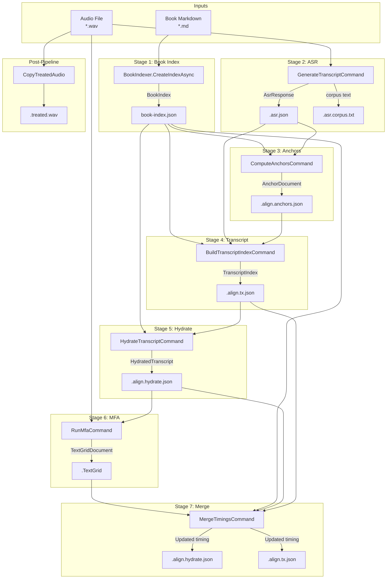

# AMS Pipeline Flow - Complete Reference

This document is the **definitive reference** for understanding the AMS audio processing pipeline. It synthesizes all Phase 2 findings into a single source of truth.

## Quick Reference

### Pipeline Stages (7 Steps)

| # | Stage | Command/Method | Input | Output |
|---|-------|----------------|-------|--------|
| 1 | BookIndex | `EnsureBookIndexAsync` | Book.md | `book-index.json` |
| 2 | ASR | `GenerateTranscriptCommand` | Audio WAV | `.asr.json`, `.asr.corpus.txt` |
| 3 | Anchors | `ComputeAnchorsCommand` | BookIndex + ASR | `.align.anchors.json` |
| 4 | Transcript | `BuildTranscriptIndexCommand` | All above | `.align.tx.json` |
| 5 | Hydrate | `HydrateTranscriptCommand` | Transcript + Book | `.align.hydrate.json` |
| 6 | MFA | `RunMfaCommand` | Audio + Hydrate | `.TextGrid` |
| 7 | Merge | `MergeTimingsCommand` | TextGrid + existing | Updated `.hydrate.json`, `.tx.json` |

### Concurrency Resources (3 Semaphores)

| Resource | Purpose | Stage |
|----------|---------|-------|
| `BookIndexSemaphore` | Prevent concurrent book index builds | 1 |
| `AsrSemaphore` | Limit concurrent ASR requests | 2 |
| `MfaSemaphore` | Limit concurrent MFA processes | 6 |

---

## Complete Pipeline Diagram



---

## Detailed Stage Documentation

### Stage 1: Book Index

**Entry Point:** `PipelineService.EnsureBookIndexAsync()`

**Purpose:** Parse book markdown into structured word/sentence/section index

**Semaphore:** `BookIndexSemaphore` (prevents concurrent builds)

**Process:**
1. Validate book file exists
2. Check document processor cache
3. Parse book with `DocumentProcessor.ParseBookAsync()`
4. Build index with `BookIndexer.CreateIndexAsync()`
5. Serialize to JSON and write

**Key Output Fields:**
- `Words[]`: Every word with global index (0-based)
- `Sentences[]`: Sentence boundaries (start/end word indices)
- `Sections[]`: Chapter boundaries for per-chapter processing

**Skip Condition:** Index exists AND `Force = false`

---

### Stage 2: ASR (Automatic Speech Recognition)

**Entry Point:** `GenerateTranscriptCommand.ExecuteAsync()`

**Purpose:** Convert audio to word tokens with timing

**Semaphore:** `AsrSemaphore` (limits concurrent ASR requests)

**Engines:**
- **Nemo** (default): HTTP service at `localhost:5000`
- **Whisper**: Local model via Whisper.NET

**Process:**
1. Resolve ASR engine from options/environment
2. If Nemo: Check service health, export audio to temp WAV, call API
3. If Whisper: Resolve/download model, call `AsrService.TranscribeAsync()`
4. Persist `AsrResponse` to chapter documents

**Key Output Fields:**
- `Tokens[]`: Each word with `StartTime`, `Duration`, `Word`
- `ModelVersion`: Identifies ASR model used

**Skip Condition:** ASR document exists AND `Force = false`

---

### Stage 3: Anchors

**Entry Point:** `ComputeAnchorsCommand.ExecuteAsync()`

**Purpose:** Find reliable sync points between book text and ASR output

**Semaphore:** None (CPU-bound)

**Process:**
1. Build book anchor view: `AnchorPreprocessor.BuildBookView(book)`
2. Build ASR anchor view: `AnchorPreprocessor.BuildAsrView(asr)`
3. Resolve section (manual override or auto-detect)
4. Compute anchors: `AnchorPipeline.ComputeAnchors()`
5. Persist `AnchorDocument` to chapter documents

**Algorithm:**
- NGram matching (default n=3)
- Filter stopwords from both views
- Match sequences at minimum separation
- Build alignment windows between anchors

**Key Output Fields:**
- `Anchors[]`: `{BookPosition, AsrPosition}` pairs
- `Windows[]`: Alignment windows for transcript stage
- `Section`: Detected chapter boundaries

**Skip Condition:** Anchors document exists AND `Force = false`

---

### Stage 4: Transcript Index

**Entry Point:** `BuildTranscriptIndexCommand.ExecuteAsync()`

**Purpose:** Create word-level alignment between book and ASR

**Semaphore:** None (CPU-bound)

**Process:**
1. Build book and ASR anchor views (same as Stage 3)
2. Compute anchors and alignment windows
3. Build phoneme views for pronunciation matching
4. Align windows: `TranscriptAligner.AlignWindows()` (Dynamic Time Warping)
5. Build rollups: sentences and paragraphs
6. Compute initial timing from ASR tokens
7. Persist `TranscriptIndex` to chapter documents

**Key Output Fields:**
- `Words[]`: `{BookIdx, AsrIdx, Op, Score}` alignment operations
- `Sentences[]`: Sentence-level alignment with WER metrics
- `Paragraphs[]`: Paragraph-level rollup

**Skip Condition:** Transcript document exists AND `Force = false`

---

### Stage 5: Hydrate

**Entry Point:** `HydrateTranscriptCommand.ExecuteAsync()`

**Purpose:** Enrich transcript with original text and analysis

**Semaphore:** None (CPU-bound)

**Process:**
1. Load `TranscriptIndex` from chapter documents
2. For each word alignment: add book/ASR word text
3. For each sentence: build text diff, compute metrics
4. For each paragraph: aggregate sentence data
5. Persist `HydratedTranscript` to chapter documents

**Key Output Fields:**
- `Words[]`: Includes `BookWord`, `AsrWord`, `StartSec`, `EndSec`
- `Sentences[]`: Includes `BookText`, `ScriptText`, `Diff`
- `Paragraphs[]`: Includes full paragraph text

**Skip Condition:** Hydrate document exists AND `Force = false`

---

### Stage 6: MFA (Montreal Forced Aligner)

**Entry Point:** `RunMfaCommand.ExecuteAsync()`

**Purpose:** Get precise word/phone-level timing from forced alignment

**Semaphore:** `MfaSemaphore` (limits concurrent MFA processes)

**Workspace Pool:** MFA workspaces (`~/Documents/MFA_1`, `MFA_2`, ...)

**Process:**
1. Validate hydrate file and audio file exist
2. Rent MFA workspace from pool
3. Set `MFA_ROOT_DIR` environment variable (if shared process)
4. Call `MfaWorkflow.RunChapterAsync()`
   - Validate corpus
   - Generate OOV pronunciations (G2P)
   - Create custom dictionary
   - Run forced alignment
5. Return workspace to pool
6. Invalidate TextGrid cache

**Key Output:** TextGrid file with word intervals

**Skip Condition:** TextGrid exists AND `Force = false`

---

### Stage 7: Merge Timings

**Entry Point:** `MergeTimingsCommand.ExecuteAsync()`

**Purpose:** Apply precise MFA timing back to hydrate and transcript

**Semaphore:** None (CPU-bound)

**Process:**
1. Parse TextGrid word intervals
2. Load book index for word matching
3. Match TextGrid words to book index positions
4. Update word-level timing in hydrate
5. Update sentence-level timing in transcript
6. Save changes to both documents

**Key Transformation:**
- TextGrid: `{word, start, end}` intervals
- Matched to: Book word indices
- Applied to: `HydratedWord.StartSec/EndSec`, `SentenceAlign.Timing`

**Always runs:** If TextGrid exists (no skip condition)

---

## Artifact Summary

### Per-Book Artifacts

| Artifact | Location | Size |
|----------|----------|------|
| `book-index.json` | `{book-root}/` | 2-5 MB |

### Per-Chapter Artifacts

| Artifact | Location | Size |
|----------|----------|------|
| `{id}.asr.json` | `{chapter}/` | 100-500 KB |
| `{id}.asr.corpus.txt` | `{chapter}/` | 50-200 KB |
| `{id}.align.anchors.json` | `{chapter}/` | 10-50 KB |
| `{id}.align.tx.json` | `{chapter}/` | 200-800 KB |
| `{id}.align.hydrate.json` | `{chapter}/` | 500 KB - 2 MB |
| `{id}.TextGrid` | `{chapter}/alignment/mfa/` | 50-200 KB |
| `{id}.treated.wav` | `{chapter}/` | Same as source |

---

## Concurrency Model

### Single Chapter

Stages execute **sequentially** due to data dependencies:

```
BookIndex → ASR → Anchors → Transcript → Hydrate → MFA → Merge
```

### Multiple Chapters (Batch)

Chapters can execute **in parallel**, guarded by semaphores:

```
Chapter 1: [ASR] → [Anchors] → [Transcript] → [Hydrate] → [MFA] → [Merge]
Chapter 2:    [ASR] → [Anchors] → [Transcript] → [Hydrate] →    [MFA] → [Merge]
Chapter 3:       [ASR] → [Anchors] → [Transcript] → [Hydrate] →       [MFA] → ...
                    ↑                                              ↑
                 AsrSemaphore                                  MfaSemaphore
```

### Bottlenecks

1. **ASR Service**: External HTTP service capacity
2. **MFA Process**: Limited by workspace pool size
3. **Book Index**: First chapter blocks on build; others wait on semaphore

---

## Conditional Execution

Each stage can be skipped based on:

1. **Stage Range**: `StartStage` and `EndStage` options
2. **Existing Output**: Document already exists in chapter
3. **Force Flag**: `Force = true` overrides existence check

This enables:
- Resuming partial runs
- Re-running specific stages
- Skipping expensive stages

---

## Open Questions Answered

### Q: What is the exact pipeline step order?

**A:** 7 steps in fixed order:
1. BookIndex (build or load)
2. ASR (generate tokens)
3. Anchors (find sync points)
4. Transcript (word alignment)
5. Hydrate (enrich with text)
6. MFA (forced alignment)
7. Merge (apply MFA timing)

### Q: What is book indexing vs ASR response indexing?

**A:** Two distinct operations:

- **Book Indexing** (Stage 1): One-time parsing of book markdown into structured `BookIndex`. Creates word/sentence/section arrays. Saved to `book-index.json`.

- **ASR Response Indexing** (Stages 3-4): Per-alignment preprocessing that builds filtered token views for matching. Creates `AsrAnchorView` with `FilteredToOriginalToken` mapping. In-memory only.

See [INDEXING.md](./INDEXING.md) for complete details.

### Q: How does error handling work across the pipeline?

**A:**
- Validation errors thrown at stage entry
- Stage failures propagate up (no automatic retry)
- Semaphores released in `finally` blocks
- MFA workspaces returned even on failure
- Chapter context wrapped in `using` for cleanup

---

## Related Documents

- [PIPELINE-ORCHESTRATION.md](./PIPELINE-ORCHESTRATION.md) - Detailed orchestration flow
- [DATA-FLOW.md](./DATA-FLOW.md) - Data types and transformations
- [ARTIFACTS.md](./ARTIFACTS.md) - Complete artifact inventory
- [INDEXING.md](./INDEXING.md) - Book vs ASR indexing explanation
