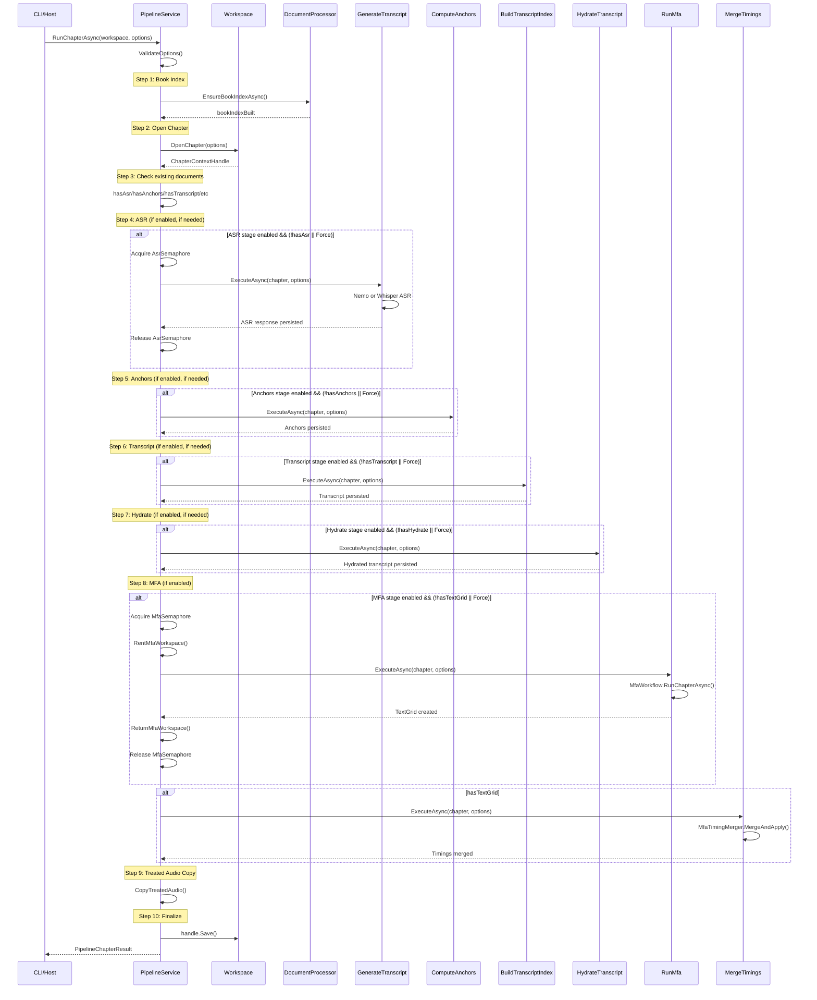

# Pipeline Orchestration Flow

This document describes the exact orchestration flow of `PipelineService.RunChapterAsync`, including command execution order, dependencies between stages, and concurrency control patterns.

## Overview

The AMS pipeline processes audio through a series of stages: ASR (automatic speech recognition), alignment, forced alignment (MFA), and timing merge. The orchestrator is `PipelineService.RunChapterAsync`, which coordinates 6 command classes.

**Source File:** `host/Ams.Core/Services/PipelineService.cs`

## Entry Point: RunChapterAsync

### Method Signature

```csharp
public async Task<PipelineChapterResult> RunChapterAsync(
    IWorkspace workspace,
    PipelineRunOptions options,
    CancellationToken cancellationToken = default)
```

### Entry Conditions

Before any stage runs, the method performs:

1. **Null validation**: Both `workspace` and `options` must be non-null
2. **Options validation**: Checks that `ChapterId`, `BookFile`, `BookIndexFile`, and `AudioFile` are provided
3. **Directory creation**: Ensures the book index output directory exists
4. **Book index building**: Conditionally builds/rebuilds the book index

## Pipeline Stages

The pipeline defines 7 stages in `PipelineStage.cs`:

| Value | Stage | Description |
|-------|-------|-------------|
| 0 | Pending | Initial state |
| 1 | BookIndex | Book text parsing and indexing |
| 2 | Asr | Automatic speech recognition |
| 3 | Anchors | Anchor point computation |
| 4 | Transcript | Transcript index building |
| 5 | Hydrate | Transcript hydration |
| 6 | Mfa | Montreal Forced Aligner |
| 7 | Complete | Terminal state |

Stages are enabled based on `StartStage` and `EndStage` in options:

```csharp
private static bool IsStageEnabled(PipelineStage stage, PipelineRunOptions options)
{
    var start = Math.Max((int)PipelineStage.BookIndex, (int)options.StartStage);
    var end = Math.Min((int)PipelineStage.Mfa, (int)options.EndStage);
    var value = (int)stage;
    return value >= start && value <= end;
}
```

## Step-by-Step Execution Trace

### Step 1: Validation and Setup

```
RunChapterAsync(workspace, options, ct)
├── ArgumentNullException.ThrowIfNull(workspace)
├── ArgumentNullException.ThrowIfNull(options)
├── ValidateOptions(options)
│   ├── Check ChapterId is non-empty
│   ├── Check BookFile is non-null
│   ├── Check BookIndexFile is non-null
│   └── Check AudioFile is non-null
└── Directory.CreateDirectory(options.BookIndexFile.Directory)
```

### Step 2: Book Index Preparation

```
EnsureBookIndexAsync(options, ct)
├── Check if force rebuild requested
├── If exists and not forcing → return false (no rebuild)
├── Acquire BookIndexSemaphore
├── Double-check after acquiring lock
├── BuildBookIndexAsync(options, ct)
│   ├── Validate book file exists
│   ├── Check DocumentProcessor cache
│   ├── Parse book with DocumentProcessor.ParseBookAsync()
│   ├── Build index with DocumentProcessor.BuildBookIndexAsync()
│   └── Serialize to JSON and write to BookIndexFile
└── Release BookIndexSemaphore
```

### Step 3: Open Chapter Context

```
workspace.OpenChapter(openOptions)
├── Create ChapterOpenOptions with:
│   ├── BookIndexFile
│   ├── AudioFile
│   ├── ChapterDirectory
│   ├── ChapterId
│   └── ReloadBookIndex (true if index was just built)
└── Returns ChapterContextHandle (IDisposable)
```

### Step 4: Document State Detection

Before running any stage, the pipeline checks what documents already exist:

```
hasAsr = chapter.Documents.Asr is not null
hasAnchors = chapter.Documents.Anchors is not null
hasTranscript = chapter.Documents.Transcript is not null
hasHydrate = chapter.Documents.HydratedTranscript is not null
hasTextGrid = Check TextGrid file or document exists
```

### Step 5: Stage Execution (Conditional)

Each stage runs only if:
1. The stage is enabled (within `StartStage`..`EndStage` range)
2. AND (`Force` is true OR the output document doesn't exist)

#### Stage 2: ASR (GenerateTranscriptCommand)

```
if (IsStageEnabled(Asr) && (Force || !hasAsr))
├── WaitAsync(AsrSemaphore)
├── _generateTranscript.ExecuteAsync(chapter, options.TranscriptOptions, ct)
│   ├── Resolve ASR engine (Nemo or Whisper)
│   ├── If Nemo:
│   │   ├── EnsureServiceReadyAsync (check Nemo service health)
│   │   ├── Export audio buffer to temp WAV file
│   │   ├── Call AsrClient.TranscribeAsync()
│   │   └── Delete temp file
│   └── If Whisper:
│       ├── Resolve model path (download if needed)
│       └── Call AsrService.TranscribeAsync()
│   └── Persist: chapter.Documents.Asr = response
├── asrRan = true
└── Release(AsrSemaphore)
```

#### Stage 3: Anchors (ComputeAnchorsCommand)

```
if (IsStageEnabled(Anchors) && (Force || !hasAnchors))
├── Build anchor options (with EmitWindows = false)
├── _computeAnchors.ExecuteAsync(chapter, anchorOptions, ct)
│   ├── Call AlignmentService.ComputeAnchorsAsync()
│   └── Persist: chapter.Documents.Anchors = anchors
└── anchorsRan = true
```

**No semaphore** - anchors computation is CPU-bound and doesn't require external resources.

#### Stage 4: Transcript (BuildTranscriptIndexCommand)

```
if (IsStageEnabled(Transcript) && (Force || !hasTranscript))
├── Build transcript options (with EmitWindows = true for anchors)
├── _buildTranscriptIndex.ExecuteAsync(chapter, transcriptOptions, ct)
│   ├── Resolve audio, ASR, and book index files
│   ├── Call AlignmentService.BuildTranscriptIndexAsync()
│   └── Persist: chapter.Documents.Transcript = transcript
└── transcriptRan = true
```

**No semaphore** - CPU-bound operation.

#### Stage 5: Hydrate (HydrateTranscriptCommand)

```
if (IsStageEnabled(Hydrate) && (Force || !hasHydrate))
├── _hydrateTranscript.ExecuteAsync(chapter, options.HydrationOptions, ct)
│   ├── Call AlignmentService.HydrateTranscriptAsync()
│   └── Persist via chapter.Save()
└── hydrateRan = true
```

**No semaphore** - CPU-bound operation.

#### Stage 6: MFA (RunMfaCommand + MergeTimingsCommand)

```
if (IsStageEnabled(Mfa))
├── if (Force || !hasTextGrid)
│   ├── WaitAsync(MfaSemaphore)
│   ├── workspaceRoot = options.Concurrency?.RentMfaWorkspace()
│   ├── If using shared process && workspaceRoot set:
│   │   ├── Set MFA_ROOT_DIR environment variable
│   │   └── MfaProcessSupervisor.Shutdown() (restart with new root)
│   ├── _runMfa.ExecuteAsync(chapter, mfaOptions, ct)
│   │   ├── Validate hydrate file and audio file exist
│   │   ├── MfaWorkflow.RunChapterAsync()
│   │   │   ├── Validate corpus
│   │   │   ├── Generate OOV pronunciations (G2P)
│   │   │   ├── Create custom dictionary
│   │   │   └── Run forced alignment → TextGrid
│   │   └── chapter.Documents.InvalidateTextGrid()
│   ├── mfaRan = true
│   ├── Dispose EnvironmentVariableScope (restore MFA_ROOT_DIR)
│   ├── ReturnMfaWorkspace(workspaceRoot)
│   └── Release(MfaSemaphore)
├── if (hasTextGrid)
│   ├── _mergeTimings.ExecuteAsync(chapter, mergeOptions, ct)
│   │   ├── Parse TextGrid word intervals
│   │   ├── MfaTimingMerger.MergeAndApply()
│   │   │   ├── Match TextGrid words to book index
│   │   │   ├── Update word-level timings in hydrate
│   │   │   └── Update sentence-level timings
│   │   └── chapter.Documents.SaveChanges()
│   └── Update hasHydrate/hasTranscript/hasTextGrid flags
```

### Step 6: Treated Audio Copy

```
if (!options.SkipTreatedCopy)
├── CopyTreatedAudio(source, destination, force)
│   ├── Skip if source doesn't exist
│   ├── Skip if destination exists and not forcing
│   └── File.Copy(source → destination)
```

### Step 7: Finalization

```
handle.Save()  // Persist all chapter changes
return PipelineChapterResult(...)
```

## Sequence Diagram



## Command Dependency Matrix

| Command | Depends On | Produces | Consumes |
|---------|------------|----------|----------|
| **EnsureBookIndex** | Book file | `BookIndex` JSON | Book markdown file |
| **GenerateTranscript** | BookIndex | `AsrResponse` (.asr.json) | Audio file, ASR service |
| **ComputeAnchors** | ASR output | `AnchorSet` (.anchors.json) | ASR tokens, BookIndex |
| **BuildTranscriptIndex** | Anchors, ASR | `TranscriptIndex` (.tx.json) | Audio, ASR, BookIndex, Anchors |
| **HydrateTranscript** | TranscriptIndex | `HydratedTranscript` (.hydrate.json) | Transcript, BookIndex |
| **RunMfa** | HydratedTranscript | TextGrid file | Audio, Hydrate file, MFA service |
| **MergeTimings** | TextGrid | Updated Hydrate + Transcript | TextGrid, BookIndex |

## Execution Order Diagram

```
BookFile (markdown)
    │
    ▼
┌───────────────────┐
│ EnsureBookIndex   │ → BookIndex.json
└─────────┬─────────┘
          │
    ┌─────┴─────┐
    ▼           ▼
AudioFile   BookIndex
    │           │
    ▼           │
┌───────────────┴───┐
│ GenerateTranscript│ → .asr.json, .asr.txt
│   (ASR stage)     │
└─────────┬─────────┘
          │
          ▼
┌───────────────────┐
│ ComputeAnchors    │ → .anchors.json
│  (Anchors stage)  │
└─────────┬─────────┘
          │
          ▼
┌───────────────────┐
│ BuildTranscript   │ → .tx.json
│  (Transcript)     │
└─────────┬─────────┘
          │
          ▼
┌───────────────────┐
│ HydrateTranscript │ → .hydrate.json
│  (Hydrate stage)  │
└─────────┬─────────┘
          │
          ▼
┌───────────────────┐
│ RunMfa            │ → .TextGrid
│  (MFA stage)      │
└─────────┬─────────┘
          │
          ▼
┌───────────────────┐
│ MergeTimings      │ → Updated .hydrate.json, .tx.json
│  (MFA stage)      │
└─────────┬─────────┘
          │
          ▼
┌───────────────────┐
│ CopyTreatedAudio  │ → .treated.wav
└───────────────────┘
```

## Concurrency Control

### Semaphores

The pipeline uses `PipelineConcurrencyControl` to manage concurrent access to shared resources:

| Semaphore | Default Capacity | Purpose |
|-----------|------------------|---------|
| `BookIndexSemaphore` | 1-N | Prevent concurrent book index builds |
| `AsrSemaphore` | 1-N | Limit concurrent ASR requests |
| `MfaSemaphore` | 1-N | Limit concurrent MFA processes |

### Semaphore Usage Patterns

**ASR Stage:**
```csharp
await WaitAsync(options.Concurrency?.AsrSemaphore, ct);
try {
    await _generateTranscript.ExecuteAsync(...);
} finally {
    Release(options.Concurrency?.AsrSemaphore);
}
```

**MFA Stage:**
```csharp
await WaitAsync(options.Concurrency?.MfaSemaphore, ct);
try {
    workspaceRoot = options.Concurrency?.RentMfaWorkspace();
    // Set MFA_ROOT_DIR if needed
    await _runMfa.ExecuteAsync(...);
} finally {
    // Restore MFA_ROOT_DIR
    options.Concurrency?.ReturnMfaWorkspace(workspaceRoot);
    Release(options.Concurrency?.MfaSemaphore);
}
```

### MFA Workspace Pool

For parallel MFA execution, the system maintains a pool of workspace directories:

```csharp
// Workspace pool management
ConcurrentQueue<string> _mfaWorkspaceQueue;  // Available workspaces
HashSet<string> _mfaWorkspaceSet;            // All workspaces

// Rent/return pattern
string? RentMfaWorkspace()    // Dequeue from pool
void ReturnMfaWorkspace(ws)   // Enqueue back to pool
```

Default workspace locations: `~/Documents/MFA_1`, `MFA_2`, ..., `MFA_N`

### Force Index Claim

The `TryClaimBookIndexForce()` method uses atomic compare-exchange to ensure only one thread can force-rebuild the book index:

```csharp
public bool TryClaimBookIndexForce()
{
    return Interlocked.CompareExchange(ref _bookIndexForceClaimed, 1, 0) == 0;
}
```

This prevents multiple parallel pipeline runs from all rebuilding the same book index.

## Parallelism Boundaries

### Sequential Operations (Cannot Parallelize)

Within a single chapter:
- Stages must execute in order: ASR → Anchors → Transcript → Hydrate → MFA → Merge
- Each stage depends on the output of the previous stage

### Parallelizable Operations

Across multiple chapters (batch mode):
- Multiple chapters can run concurrently
- Each chapter pipeline is independent
- Shared resources are guarded by semaphores

| Stage | Can Parallelize Across Chapters? | Limiting Factor |
|-------|----------------------------------|-----------------|
| BookIndex | Yes, but shared | BookIndexSemaphore (one force rebuild) |
| ASR | Yes | AsrSemaphore, external ASR service capacity |
| Anchors | Yes | CPU-bound only |
| Transcript | Yes | CPU-bound only |
| Hydrate | Yes | CPU-bound only |
| MFA | Yes | MfaSemaphore, MFA workspace pool |
| Merge | Yes | CPU-bound only |

## Potential Bottlenecks

1. **ASR Service**: External service (Nemo at `http://localhost:5000` or `http://127.0.0.1:8765`). Limited by service capacity.

2. **MFA Process**: External Python/conda process. Requires dedicated workspace per concurrent execution.

3. **Book Index**: First chapter triggers build; subsequent chapters wait on semaphore if force rebuild requested.

4. **Memory**: ASR responses and book indices can be large. No explicit memory limiting.

## Conditional Execution Summary

Each stage can be skipped if:
- Outside the `StartStage..EndStage` range
- Document already exists (unless `Force = true`)

This enables:
- Resuming partial pipeline runs
- Re-running specific stages
- Skipping expensive stages when outputs exist

## Error Handling

- **Validation errors**: Thrown immediately before any work starts
- **Stage failures**: Exceptions propagate up; no automatic retry
- **Chapter context**: Wrapped in `using` block for automatic cleanup
- **Semaphores**: Released in `finally` blocks to prevent deadlock
- **MFA workspaces**: Returned in `finally` block to prevent pool exhaustion
