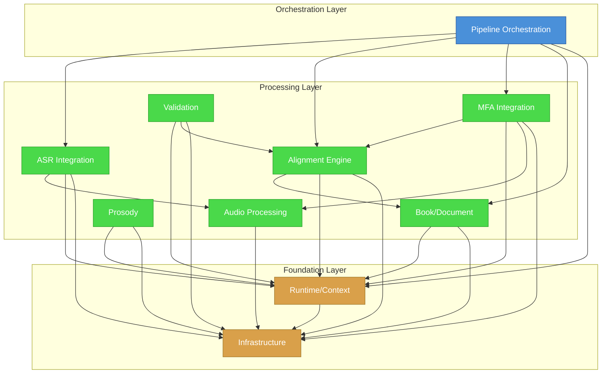

# Ams.Core Subsystem Map

**Analysis Date:** 2025-12-28
**Total Files:** 125 (actual count, excluding obj/bin)
**Prior Inventory Count:** 96 (from FILE-INVENTORY.md - may have been added since)

---

## Executive Summary

The Ams.Core library organizes into **8 distinct subsystems** with clear separation of concerns at the folder level. The Runtime subsystem is the largest (28 files), followed by Alignment (15 files) and Services (22 files including integrations).

| Metric | Value |
|--------|-------|
| Total Subsystems | 8 |
| Largest Subsystem | Runtime (28 files) |
| Most External Dependencies | FFmpeg Integration (9 files) |
| Cross-Cutting Files | 7 identified |
| Dead Code Files | 10 (from prior analysis) |

---

## Subsystem Overview

| Subsystem | File Count | Key Classes | External Dependencies |
|-----------|------------|-------------|----------------------|
| **Pipeline Orchestration** | 10 | PipelineService, Commands | None (internal only) |
| **ASR Integration** | 8 | AsrProcessor, AsrClient, AsrService | Whisper.NET, Nemo HTTP |
| **Alignment Engine** | 15 | AnchorPipeline, TranscriptAligner, AlignmentService | None |
| **MFA Integration** | 8 | MfaWorkflow, MfaProcessSupervisor | MFA CLI (conda) |
| **Audio Processing** | 15 | AudioProcessor, FfDecoder, FfFilterGraph | FFmpeg.AutoGen |
| **Book/Document** | 12 | BookParser, BookIndexer, DocumentProcessor | None |
| **Runtime/Context** | 28 | BookContext, ChapterContext, ChapterManager | None |
| **Prosody** | 9 | PauseDynamicsService, PauseMapBuilder | None |
| **Validation** | 4 | ValidationService, ValidationReportBuilder | None |
| **Infrastructure** | 16 | Log, TextNormalizer, DocumentSlot | Serilog |

---

## File-to-Subsystem Assignment

### 1. Pipeline Orchestration (10 files)

Coordinates the 7-stage pipeline flow (BookIndex -> ASR -> Anchors -> Transcript -> Hydrate -> MFA -> Merge).

| File | Primary Class | Notes |
|------|--------------|-------|
| `Services/PipelineService.cs` | PipelineService | Main orchestrator, highest fan-out |
| `Application/Commands/BuildTranscriptIndexCommand.cs` | BuildTranscriptIndexCommand | Stage 4 |
| `Application/Commands/ComputeAnchorsCommand.cs` | ComputeAnchorsCommand | Stage 3 |
| `Application/Commands/GenerateTranscriptCommand.cs` | GenerateTranscriptCommand | Stage 2 |
| `Application/Commands/HydrateTranscriptCommand.cs` | HydrateTranscriptCommand | Stage 5 |
| `Application/Commands/MergeTimingsCommand.cs` | MergeTimingsCommand | Stage 7 |
| `Application/Commands/RunMfaCommand.cs` | RunMfaCommand | Stage 6 |
| `Application/Pipeline/PipelineChapterResult.cs` | PipelineChapterResult | Result model |
| `Application/Pipeline/PipelineConcurrencyControl.cs` | PipelineConcurrencyControl | Semaphore management |
| `Application/Pipeline/PipelineRunOptions.cs` | PipelineRunOptions | Options model |
| `Application/Pipeline/PipelineStage.cs` | PipelineStage | Stage enum |

---

### 2. ASR Integration (8 files)

Handles speech recognition via Whisper.NET (local) and Nemo ASR (HTTP service).

| File | Primary Class | Notes |
|------|--------------|-------|
| `Asr/AsrClient.cs` | AsrClient | Nemo HTTP client |
| `Asr/AsrEngine.cs` | AsrEngine | Engine selection (Whisper vs Nemo) |
| `Asr/AsrModels.cs` | AsrResponse, AsrToken, etc. | Data models |
| `Asr/AsrTranscriptBuilder.cs` | AsrTranscriptBuilder | Builds transcript from ASR |
| `Processors/AsrProcessor.cs` | AsrProcessor | Whisper.NET static API |
| `Services/AsrService.cs` | AsrService | Service wrapper for AsrProcessor |
| `Services/Interfaces/IAsrService.cs` | IAsrService | Interface |
| `Application/Processes/AsrProcessSupervisor.cs` | AsrProcessSupervisor | External process management |

**Dead Code (4 files):**
| `Services/Integrations/ASR/WhisperNet/WnModel.cs` | WnModel | Empty placeholder |
| `Services/Integrations/ASR/WhisperNet/WnSession.cs` | WnSession | Empty placeholder |
| `Services/Integrations/ASR/WhisperNet/WnTranscriber.cs` | WnTranscriber | Empty placeholder |
| `Services/Integrations/ASR/WhisperNet/WnUtils.cs` | WnUtils | Empty placeholder |

---

### 3. Alignment Engine (15 files)

Core algorithms for text-audio alignment using anchors, DTW, and word matching.

| File | Primary Class | Notes |
|------|--------------|-------|
| `Processors/Alignment/Anchors/AnchorDiscovery.cs` | AnchorDiscovery | Finds sync points |
| `Processors/Alignment/Anchors/AnchorPipeline.cs` | AnchorPipeline | Pipeline entry point |
| `Processors/Alignment/Anchors/AnchorPreprocessor.cs` | AnchorPreprocessor | Text preprocessing |
| `Processors/Alignment/Anchors/AnchorTokenizer.cs` | AnchorTokenizer | Tokenization |
| `Processors/Alignment/Anchors/SectionLocator.cs` | SectionLocator | Chapter/section detection |
| `Processors/Alignment/Anchors/StopwordSets.cs` | StopwordSets | Stopword configuration |
| `Processors/Alignment/Tx/TranscriptAligner.cs` | TranscriptAligner | DTW alignment |
| `Processors/Alignment/Tx/WindowBuilder.cs` | WindowBuilder | Alignment windows |
| `Processors/Diffing/TextDiffAnalyzer.cs` | TextDiffAnalyzer | WER/CER calculation |
| `Services/Alignment/AlignmentOptions.cs` | AlignmentOptions | Options models |
| `Services/Alignment/AlignmentService.cs` | AlignmentService | High-level service |
| `Services/Interfaces/IAlignmentService.cs` | IAlignmentService | Interface |
| `Artifacts/Alignment/AnchorDocument.cs` | AnchorDocument | Anchor artifact |
| `Artifacts/Alignment/MfaChapterContext.cs` | MfaChapterContext | **Cross-cutting** with MFA |
| `Artifacts/Alignment/MfaCommandResult.cs` | MfaCommandResult | **Cross-cutting** with MFA |

---

### 4. MFA Integration (8 files)

Montreal Forced Aligner integration for precise word/phone timing.

| File | Primary Class | Notes |
|------|--------------|-------|
| `Application/Mfa/MfaDetachedProcessRunner.cs` | MfaDetachedProcessRunner | Detached process execution |
| `Application/Mfa/MfaPronunciationProvider.cs` | MfaPronunciationProvider | Pronunciation lookup |
| `Application/Mfa/MfaService.cs` | MfaService, IMfaService | Service + interface |
| `Application/Mfa/MfaWorkflow.cs` | MfaWorkflow | Full MFA workflow |
| `Application/Processes/MfaProcessSupervisor.cs` | MfaProcessSupervisor | Conda environment mgmt |
| `Processors/Alignment/Mfa/MfaTimingMerger.cs` | MfaTimingMerger | Merges TextGrid timing |
| `Processors/Alignment/Mfa/TextGridParser.cs` | TextGridParser | Praat TextGrid parsing |
| `Artifacts/Alignment/Mfa/TextGridDocument.cs` | TextGridDocument | TextGrid model |

---

### 5. Audio Processing (15 files)

FFmpeg-based audio decode/encode/filter operations.

| File | Primary Class | Notes |
|------|--------------|-------|
| `Processors/AudioProcessor.cs` | AudioProcessor | Main audio facade |
| `Processors/AudioProcessor.Analysis.cs` | AudioProcessor (partial) | Analysis methods |
| `Services/Integrations/FFmpeg/FfDecoder.cs` | FfDecoder | Audio decoding |
| `Services/Integrations/FFmpeg/FfEncoder.cs` | FfEncoder | Audio encoding |
| `Services/Integrations/FFmpeg/FfFilterGraph.cs` | FfFilterGraph | Filter graph builder |
| `Services/Integrations/FFmpeg/FfFilterGraphRunner.cs` | FfFilterGraphRunner | Filter graph executor |
| `Services/Integrations/FFmpeg/FfLogCapture.cs` | FfLogCapture | Log capture |
| `Services/Integrations/FFmpeg/FfResampler.cs` | FfResampler | Audio resampling |
| `Services/Integrations/FFmpeg/FfSession.cs` | FfSession | Session management |
| `Services/Integrations/FFmpeg/FfUtils.cs` | FfUtils | Utilities |
| `Services/Integrations/FFmpeg/FilterSpecs.cs` | FilterSpecs | Filter specifications |
| `Audio/AudioIntegrityVerifier.cs` | AudioIntegrityVerifier | Integrity checks |
| `Audio/FeatureExtraction.cs` | FeatureExtraction | Breath detection |
| `Artifacts/AudioBuffer.cs` | AudioBuffer | Sample buffer |
| `Artifacts/AudioBufferMetadata.cs` | AudioBufferMetadata | Buffer metadata |

**Dead Code (2 files):**
| `Audio/DspDemoRunner.cs` | DspDemoRunner | Demo code, no callers |
| `Audio/SentenceTimelineBuilder.cs` | SentenceTimelineBuilder | Orphaned, zero callers |

---

### 6. Book/Document Processing (12 files)

Book parsing, indexing, and document structure.

| File | Primary Class | Notes |
|------|--------------|-------|
| `Runtime/Book/BookParser.cs` | BookParser | Markdown parsing |
| `Runtime/Book/BookIndexer.cs` | BookIndexer | Creates BookIndex |
| `Runtime/Book/BookModels.cs` | BookIndex, BookWord, etc. | Data models |
| `Runtime/Book/BookDocuments.cs` | BookDocuments | Document collection |
| `Runtime/Book/BookPhonemePopulator.cs` | BookPhonemePopulator | Phoneme population |
| `Runtime/Book/IBookServices.cs` | IBookParser, IBookIndexer, IBookCache | Interfaces |
| `Runtime/Book/IPronunciationProvider.cs` | IPronunciationProvider | Pronunciation interface |
| `Runtime/Book/PronunciationHelper.cs` | PronunciationHelper | Pronunciation utilities |
| `Processors/DocumentProcessor/DocumentProcessor.Cache.cs` | DocumentProcessor (partial) | Caching |
| `Processors/DocumentProcessor/DocumentProcessor.Indexing.cs` | DocumentProcessor (partial) | Indexing |
| `Processors/DocumentProcessor/DocumentProcessor.Phonemes.cs` | DocumentProcessor (partial) | Phonemes |
| `Services/Documents/DocumentService.cs` | DocumentService | High-level service |
| `Services/Interfaces/IDocumentService.cs` | IDocumentService | Interface |

---

### 7. Runtime/Context (28 files)

Book and chapter lifecycle management, artifact resolution, and workspace abstraction.

| File | Primary Class | Notes |
|------|--------------|-------|
| `Runtime/Book/BookCache.cs` | BookCache | Book caching |
| `Runtime/Book/BookContext.cs` | BookContext | Book runtime context |
| `Runtime/Book/BookManager.cs` | BookManager | Book lifecycle |
| `Runtime/Chapter/ChapterContext.cs` | ChapterContext | Chapter runtime context |
| `Runtime/Chapter/ChapterContextHandle.cs` | ChapterContextHandle | RAII handle |
| `Runtime/Chapter/ChapterDocuments.cs` | ChapterDocuments | Chapter artifacts |
| `Runtime/Chapter/ChapterManager.cs` | ChapterManager | Chapter lifecycle |
| `Runtime/Audio/AudioBufferContext.cs` | AudioBufferContext | Audio buffer context |
| `Runtime/Audio/AudioBufferManager.cs` | AudioBufferManager | Audio buffer lifecycle |
| `Runtime/Artifacts/FileArtifactResolver.cs` | FileArtifactResolver | File-based artifacts |
| `Runtime/Artifacts/IArtifactResolver.cs` | IArtifactResolver | Artifact interface |
| `Runtime/Common/DelegateDocumentSlotAdapter.cs` | DelegateDocumentSlotAdapter | Slot adapter |
| `Runtime/Common/DocumentSlot.cs` | DocumentSlot | Lazy document loading |
| `Runtime/Common/DocumentSlotOptions.cs` | DocumentSlotOptions | Slot options |
| `Runtime/Common/IDocumentSlotAdapter.cs` | IDocumentSlotAdapter | Adapter interface |
| `Runtime/Interfaces/IAudioBufferManager.cs` | IAudioBufferManager | Interface |
| `Runtime/Interfaces/IBookManager.cs` | IBookManager | Interface |
| `Runtime/Interfaces/IChapterManager.cs` | IChapterManager | Interface |
| `Runtime/Workspace/IWorkspace.cs` | IWorkspace | Workspace interface |
| `Runtime/Workspace/WorkspaceChapterDiscovery.cs` | WorkspaceChapterDiscovery | Chapter discovery |
| `Artifacts/FragmentTiming.cs` | FragmentTiming | Timing model |
| `Artifacts/SentenceTiming.cs` | SentenceTiming | Timing model |
| `Artifacts/TimingOverrides.cs` | TimingOverrides | Manual overrides |
| `Artifacts/TimingRange.cs` | TimingRange | Time range model |
| `Artifacts/TranscriptModels.cs` | TranscriptIndex, WordAlign, etc. | Transcript models |
| `Artifacts/Hydrate/HydratedTranscript.cs` | HydratedTranscript | Hydrated model |
| `Artifacts/Validation/ValidationReportModels.cs` | ValidationReportModels | Report models |

---

### 8. Prosody (9 files)

Pause detection, dynamics, and timeline manipulation.

| File | Primary Class | Notes |
|------|--------------|-------|
| `Prosody/PauseAdjustmentsDocument.cs` | PauseAdjustmentsDocument | Adjustment storage |
| `Prosody/PauseAnalysisReport.cs` | PauseAnalysisReport | Analysis report |
| `Prosody/PauseCompressionMath.cs` | PauseCompressionMath | Compression math |
| `Prosody/PauseDynamicsService.cs` | PauseDynamicsService, IPauseDynamicsService | Service + interface |
| `Prosody/PauseMapBuilder.cs` | PauseMapBuilder | Builds pause maps |
| `Prosody/PauseMapModels.cs` | PauseMap, PauseMapEntry | Data models |
| `Prosody/PauseModels.cs` | PauseModels | General models |
| `Prosody/PausePolicyStorage.cs` | PausePolicyStorage | Policy persistence |
| `Prosody/PauseTimelineApplier.cs` | PauseTimelineApplier | Applies pauses |

---

### 9. Validation (4 files)

Validation report generation and script validation.

| File | Primary Class | Notes |
|------|--------------|-------|
| `Services/ValidationService.cs` | ValidationService | Validation orchestration |
| `Processors/Validation/ValidationReportBuilder.cs` | ValidationReportBuilder | Report building |
| `Validation/ScriptValidator.cs` | ScriptValidator | Script validation |
| `Validation/ValidationModels.cs` | ValidationModels | Validation data models |

---

### 10. Infrastructure (16 files)

Cross-cutting utilities, logging, and configuration.

| File | Primary Class | Notes |
|------|--------------|-------|
| `Common/LevenshteinMetrics.cs` | LevenshteinMetrics | Edit distance |
| `Common/Log.cs` | Log | Serilog wrapper |
| `Common/TextNormalizer.cs` | TextNormalizer | Text normalization |
| `GlobalUsings.cs` | - | Global imports |
| `AssemblyInfo.cs` | - | Assembly metadata |
| `Pipeline/SentenceRefinementService.cs` | SentenceRefinementService | **Cross-cutting** with alignment |

**Dead Code (2 files):**
| `Pipeline/ManifestV2.cs` | ManifestV2 | Superseded format |
| `Services/AudioService.cs` | AudioService | Empty placeholder |
| `Services/Interfaces/IAudioService.cs` | IAudioService | Unused interface |

---

## Cross-Cutting Concerns

Files that span multiple subsystems and may indicate responsibility bleeding:

| File | Subsystems Touched | Why Cross-Cutting |
|------|-------------------|-------------------|
| `ChapterContext.cs` | Runtime, Alignment | Contains `GetOrResolveSection()` logic that duplicates AlignmentService |
| `AlignmentService.cs` | Alignment, Runtime, Diffing | 681 lines, handles anchors + transcript + hydration + rollups |
| `PipelineService.cs` | Pipeline, Runtime, All Commands | Orchestrator needs visibility into all subsystems |
| `MfaChapterContext.cs` | MFA, Alignment | Named MFA but placed in Alignment artifacts |
| `MfaCommandResult.cs` | MFA, Alignment | Named MFA but placed in Alignment artifacts |
| `SentenceRefinementService.cs` | Pipeline, Alignment | In Pipeline folder but works with alignment |
| `AsrProcessor.cs` | ASR, Audio | Contains audio normalization logic |

---

## Subsystem Dependency Graph

---

## Subsystem Health Assessment

| Subsystem | Cohesion | Coupling | Notes |
|-----------|----------|----------|-------|
| Pipeline Orchestration | 9/10 | 3/10 | Well-focused, but high fan-out |
| ASR Integration | 7/10 | 4/10 | Dual engine support adds complexity |
| Alignment Engine | 8/10 | 3/10 | Good isolation, complex algorithms |
| MFA Integration | 8/10 | 3/10 | Well-contained, external process mgmt |
| Audio Processing | 7/10 | 2/10 | FFmpeg wrapper is clean |
| Book/Document | 8/10 | 2/10 | Clear purpose, minimal deps |
| Runtime/Context | 6/10 | 5/10 | Large, some responsibility bleeding |
| Prosody | 9/10 | 2/10 | Self-contained feature area |
| Validation | 8/10 | 3/10 | Clear purpose |
| Infrastructure | 7/10 | 1/10 | True cross-cutting utilities |

---

## Recommendations

1. **Move MfaChapterContext/MfaCommandResult to Application/Mfa** - These are MFA-specific, not general alignment artifacts

2. **Extract section resolution from ChapterContext** - `GetOrResolveSection()` duplicates `AlignmentService.TryExtractChapterNumber()` and `EnumerateLabelCandidates()`

3. **Split AlignmentService** - At 681 lines, this service handles anchors, transcript building, hydration, and rollups. Consider splitting into:
   - AnchorService (compute anchors)
   - TranscriptBuildService (build index)
   - HydrationService (hydrate transcript)

4. **Remove dead Whisper.NET placeholders** - WnModel, WnSession, WnTranscriber, WnUtils are empty and never used

5. **Archive or remove dormant code** - DspDemoRunner, SentenceTimelineBuilder, ManifestV2, AudioService/IAudioService

---

*Generated: 2025-12-28*
