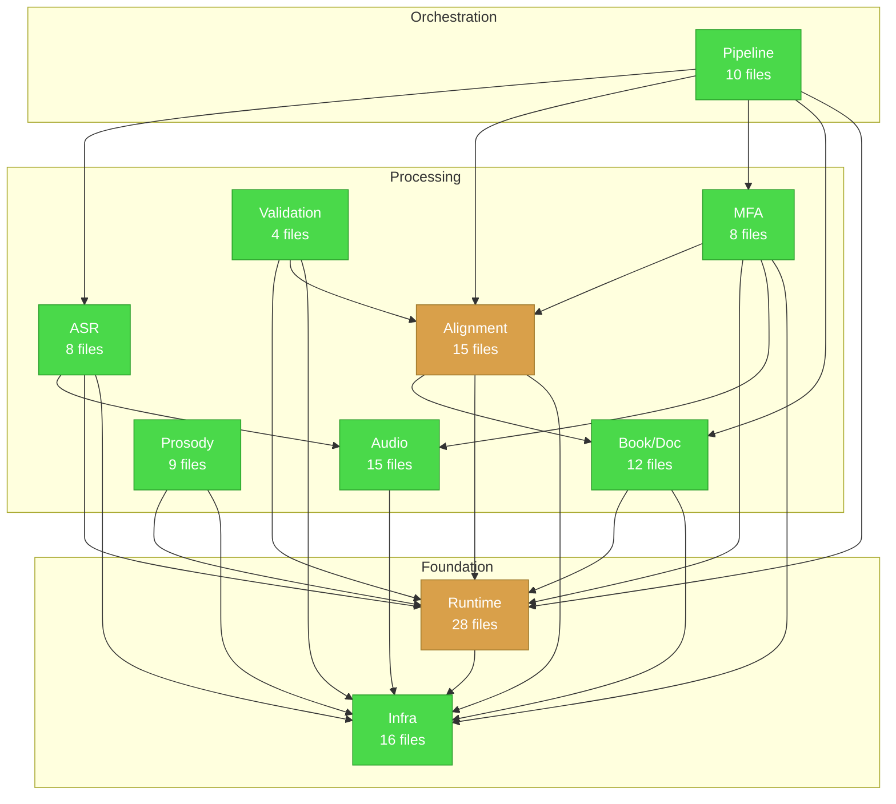

# AMS Responsibility Map

**Analysis Date:** 2025-12-28
**Reference Documents:**
- CORE-SUBSYSTEMS.md (subsystem categorization)
- SCATTERED-LOGIC.md (scattered responsibility analysis)
- DEAD-CODE.md (orphaned files and methods)

---

## Executive Summary

| Metric | Value |
|--------|-------|
| Subsystems identified | 10 |
| Scattered patterns | 7 |
| Over-abstractions | 9 |
| Dead code items | 21 (files + methods) |
| Refactoring priority items | 12 |

The AMS codebase demonstrates a **clean 3-layer architecture** at the project level (Hosts -> Core -> Native), but the **internal organization of Ams.Core** shows signs of organic growth with several consolidation opportunities.

**Key Findings:**
1. **Runtime subsystem is oversized** (28 files) and could be split
2. **AlignmentService is a god class** at 681 lines with 4 distinct responsibilities
3. **9 interfaces have only single implementations** - some add value, some add indirection
4. **~650 lines of dead code** can be safely removed

---

## Subsystem Architecture

### Subsystem Distribution

```
                    Ams.Core (125 files)
    ┌────────────────────────────────────────────────────────┐
    │                                                        │
    │  ┌─────────────────────────────────────────────────┐  │
    │  │         Orchestration Layer (10 files)          │  │
    │  │  PipelineService + 6 Commands + Models          │  │
    │  └─────────────────────────────────────────────────┘  │
    │                         │                              │
    │  ┌──────────────────────┼──────────────────────────┐  │
    │  │              Processing Layer (59 files)         │  │
    │  │  ┌────────┐ ┌────────┐ ┌────────┐ ┌────────┐    │  │
    │  │  │  ASR   │ │ Align  │ │  MFA   │ │ Audio  │    │  │
    │  │  │ (8)    │ │ (15)   │ │ (8)    │ │ (15)   │    │  │
    │  │  └────────┘ └────────┘ └────────┘ └────────┘    │  │
    │  │  ┌────────┐ ┌────────┐ ┌────────┐               │  │
    │  │  │  Book  │ │Prosody │ │ Valid  │               │  │
    │  │  │ (12)   │ │ (9)    │ │ (4)    │               │  │
    │  │  └────────┘ └────────┘ └────────┘               │  │
    │  └─────────────────────────────────────────────────┘  │
    │                         │                              │
    │  ┌─────────────────────────────────────────────────┐  │
    │  │          Foundation Layer (56 files)            │  │
    │  │    Runtime/Context (28) + Infrastructure (16)   │  │
    │  │            + Artifact Models (12)               │  │
    │  └─────────────────────────────────────────────────┘  │
    │                                                        │
    └────────────────────────────────────────────────────────┘
```

### Layer Health

| Layer | Files | Cohesion | Coupling | Notes |
|-------|-------|----------|----------|-------|
| Orchestration | 10 | 9/10 | 3/10 | Clean command pattern |
| Processing | 59 | 7/10 | 4/10 | Good isolation, some god classes |
| Foundation | 56 | 6/10 | 5/10 | Runtime is oversized |

---

## Responsibility Issues

### Scattered Logic (from SCATTERED-LOGIC.md)

**Top 5 Most Impactful Scattered Patterns:**

| # | Pattern | Impact | Quick Win? |
|---|---------|--------|------------|
| 1 | Section Resolution Duplication | HIGH - Bug-prone duplication in ChapterContext + AlignmentService | YES |
| 2 | Alignment Service God Class | HIGH - 681 lines, 4 responsibilities, hard to test | NO |
| 3 | ASR Buffer Preparation Split | MEDIUM - Two different mono downmix implementations | YES |
| 4 | MFA Artifacts in Wrong Location | LOW - Cohesion issue, easy fix | YES |
| 5 | Document Loading Patterns | MEDIUM - Inconsistent caching strategies | NO |

---

### Over-Abstraction Catalogue

Analysis of interfaces vs implementations to identify premature or unnecessary abstractions.

| Abstraction | Type | Implementations | Usage Count | Verdict | Action |
|-------------|------|-----------------|-------------|---------|--------|
| `IAudioService` | Interface | 1 (AudioService) | 0 callers | **REMOVE** | Delete interface + empty impl |
| `IAsrService` | Interface | 1 (AsrService) | 1 caller | **KEEP** | Enables DI/testing |
| `IAlignmentService` | Interface | 1 (AlignmentService) | 2 callers | **KEEP** | Enables DI/testing |
| `IDocumentService` | Interface | 1 (DocumentService) | 3+ callers | **KEEP** | Active use |
| `IPauseDynamicsService` | Interface | 1 (PauseDynamicsService) | 2+ callers | **KEEP** | Enables DI/testing |
| `IMfaService` | Interface | 1 (MfaService) | 0 callers | **SIMPLIFY** | Consider removing if not used for DI |
| `IArtifactResolver` | Interface | 1 (FileArtifactResolver) | 3+ callers | **KEEP** | Enables testing/alternative storage |
| `IBookManager` | Interface | 1 (BookManager) | 1 caller | **KEEP** | Part of workspace abstraction |
| `IChapterManager` | Interface | 1 (ChapterManager) | 1 caller | **KEEP** | Part of workspace abstraction |
| `IAudioBufferManager` | Interface | 1 (AudioBufferManager) | 2+ callers | **KEEP** | Enables testing |
| `IWorkspace` | Interface | 1 (CliWorkspace) | 5+ callers | **KEEP** | Host abstraction |
| `IBookParser` | Interface | 1 (BookParser) | 1 caller | **SIMPLIFY** | May not need interface |
| `IBookIndexer` | Interface | 1 (BookIndexer) | 1 caller | **SIMPLIFY** | May not need interface |
| `IBookCache` | Interface | 1 (BookCache) | 1 caller | **SIMPLIFY** | May not need interface |
| `IPronunciationProvider` | Interface | 2+ implementations | 3+ callers | **KEEP** | Multiple implementations |
| `IDocumentSlotAdapter` | Interface | 1 (DelegateDocumentSlotAdapter) | Internal | **KEEP** | Extension point |

**Summary:**
- **REMOVE:** 1 (IAudioService)
- **SIMPLIFY:** 4 (IMfaService, IBookParser, IBookIndexer, IBookCache)
- **KEEP:** 10

---

### Over-Abstraction Detail: Empty Placeholders

**Whisper.NET Placeholders (4 files, 32 lines):**

| File | Content | Verdict |
|------|---------|---------|
| `WnModel.cs` | Empty class `public sealed class WnModel { }` | DELETE |
| `WnSession.cs` | Empty class | DELETE |
| `WnTranscriber.cs` | Empty class | DELETE |
| `WnUtils.cs` | Empty class | DELETE |

These were scaffolded for a refactoring that never happened. The actual Whisper.NET integration lives in `AsrProcessor.cs` using `WhisperFactory`/`WhisperProcessor` from the NuGet package directly.

**AudioService Placeholder (18 lines):**

```csharp
// IAudioService.cs
public interface IAudioService
{
    Task WarmAsync(CancellationToken cancellationToken = default);
}

// AudioService.cs
public sealed class AudioService : IAudioService
{
    public Task WarmAsync(CancellationToken cancellationToken = default) =>
        Task.CompletedTask;  // Does nothing!
}
```

**Verdict:** DELETE both. No consumers, never registered in DI.

---

### Over-Abstraction Detail: Premature Generalization

**DocumentSlot Pattern:**

The `DocumentSlot<T>` pattern with `IDocumentSlotAdapter` and `DelegateDocumentSlotAdapter` is well-designed but potentially over-engineered for current needs:

```csharp
public sealed class DocumentSlot<T>
public interface IDocumentSlotAdapter
public sealed class DelegateDocumentSlotAdapter : IDocumentSlotAdapter
public sealed record DocumentSlotOptions
```

**Assessment:** KEEP - The pattern enables lazy loading and change tracking, which is valuable for the artifact system. Not currently over-abstracted given actual usage.

---

## Recommended Consolidations

### Priority 1: Quick Wins (Complete in Phase 4)

| # | Task | Files | Effort | Impact |
|---|------|-------|--------|--------|
| 1 | Remove dead code (Wn*.cs, AudioService, ManifestV2, etc.) | 10 files | 1 hour | Clean codebase |
| 2 | Extract ChapterLabelResolver utility | 2 files | 2 hours | Remove duplication |
| 3 | Move MFA artifacts to Application/Mfa/ | 2 files | 1 hour | Improve cohesion |
| 4 | Consolidate ASR buffer preparation | 2 files | 4 hours | Single implementation |

### Priority 2: Medium-Term (Consider for Phase 4 or Later)

| # | Task | Files | Effort | Impact |
|---|------|-------|--------|--------|
| 5 | Consolidate Validation folder structure | 5 files | 4 hours | Improve discoverability |
| 6 | Review/remove unused interfaces | 4 interfaces | 2 hours | Reduce indirection |
| 7 | Standardize Prosody patterns | 9 files | 8 hours | Consistency |

### Priority 3: Architectural (Future Milestone)

| # | Task | Files | Effort | Impact |
|---|------|-------|--------|--------|
| 8 | Split AlignmentService | 1 large file | 16-24 hours | Testability, maintainability |
| 9 | Unify document loading patterns | 10+ files | 24+ hours | Consistency |
| 10 | Consider extracting Audio subsystem | 15 files | 40+ hours | Modularity |

---

## Architecture Health Score

### Scoring Methodology

Each dimension scored 1-10:
- **1-3:** Poor - Significant issues requiring immediate attention
- **4-6:** Fair - Some issues but manageable
- **7-8:** Good - Minor improvements possible
- **9-10:** Excellent - Best practices followed

### Current Scores

| Dimension | Score | Justification |
|-----------|-------|---------------|
| **Cohesion** | 6/10 | Runtime subsystem too large (28 files); AlignmentService has 4 responsibilities; MFA artifacts misplaced |
| **Coupling** | 7/10 | Clean layer separation; limited cross-subsystem dependencies; PipelineService has appropriate high fan-out |
| **Abstraction Appropriateness** | 7/10 | Most interfaces justified; 1 dead interface; 4 potentially unnecessary; good use of DocumentSlot pattern |
| **Code Organization** | 6/10 | Folder structure generally good; scattered validation files; duplicate methods in multiple files |
| **Dead Code** | 8/10 | Only ~650 lines of dead code (~0.5% of codebase); well-identified for removal |

### Overall Score: **6.8/10** (FAIR-GOOD)

**Interpretation:** The codebase has solid foundations with clean architecture at the project level. Internal organization of Ams.Core would benefit from the consolidations identified above, but the issues are manageable and don't block feature development.

---

## Phase 4 Inputs

The following items should be addressed in the Recommendations phase:

### Must Address

1. **Remove dead code** - 10 files, ~400 lines (DEAD-CODE.md)
2. **Extract duplicate section resolution** - ChapterContext + AlignmentService
3. **Relocate MFA artifacts** - Improve subsystem cohesion

### Should Address

4. **Consolidate ASR buffer preparation** - Single implementation
5. **Remove IAudioService** - Empty placeholder
6. **Review IMfaService, IBook* interfaces** - May be over-abstraction

### Consider for Later

7. **Split AlignmentService** - Large refactoring, high impact
8. **Unify document patterns** - Architectural decision needed
9. **Extract Audio to separate project** - If modularity needed

---

## Appendix: Subsystem Dependency Matrix

```
              PIPE  ASR  ALIGN  MFA  AUDIO  BOOK  PROSODY  VALID  RUNTIME  INFRA
PIPE            -    X     X     X     -     X      -        -       X       -
ASR             -    -     -     -     X     -      -        -       X       X
ALIGN           -    -     -     -     -     X      -        -       X       X
MFA             -    -     X     -     X     -      -        -       X       X
AUDIO           -    -     -     -     -     -      -        -       -       X
BOOK            -    -     -     -     -     -      -        -       X       X
PROSODY         -    -     -     -     -     -      -        -       X       X
VALID           -    -     X     -     -     -      -        -       X       X
RUNTIME         -    -     -     -     -     -      -        -       -       X
INFRA           -    -     -     -     -     -      -        -       -       -

X = depends on
- = no dependency
```

**Observations:**
- Infrastructure has zero outgoing dependencies (correct for leaf utilities)
- Runtime has zero outgoing dependencies except Infrastructure (correct for foundation)
- Pipeline has most dependencies (correct for orchestrator)
- No circular dependencies detected

---

## Mermaid Dependency Graph



**Legend:**
- Green: Healthy subsystem
- Yellow: Has identified issues (ALIGN: god class, RUNTIME: oversized)
- Red: Critical issues (none currently)

---

*Generated: 2025-12-28*
