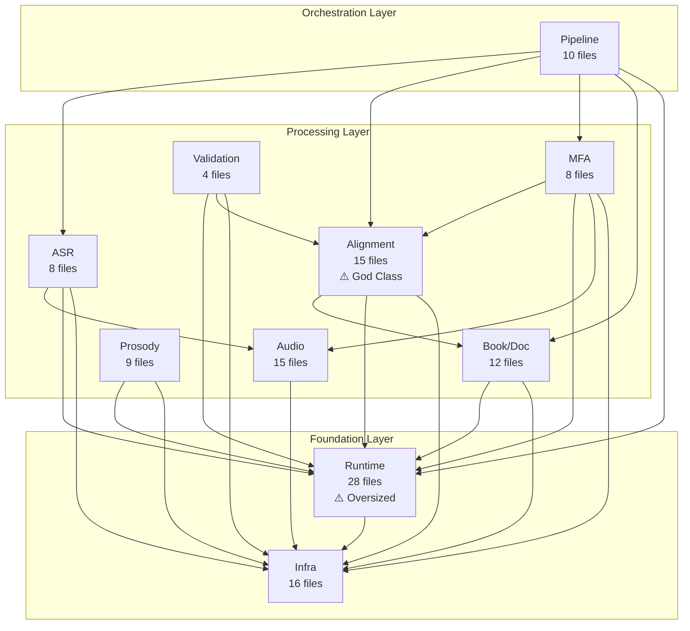
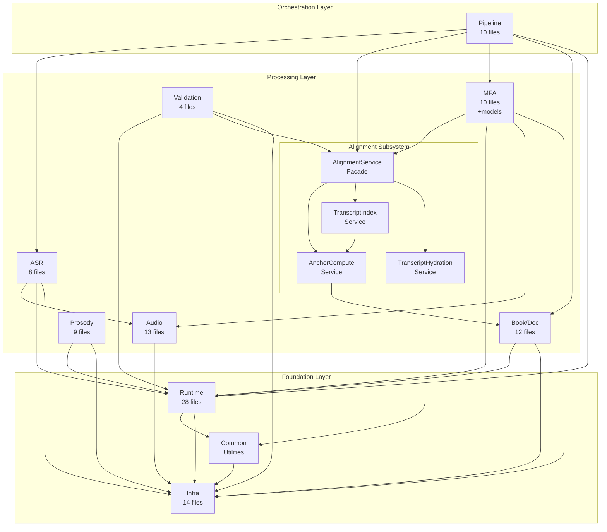

# Architecture Map

**Proposed module boundaries and architecture clarity recommendations**

Generated: 2025-12-30
Source: Phase 3 artifacts, Plan 04-01 deliverables

---

## 1. Executive Summary

### Current State

| Metric | Value | Notes |
|--------|-------|-------|
| Architecture Health | 6.8/10 | FAIR-GOOD |
| Project Count | 12 | 4 active, 8 non-active |
| Subsystems | 10 | In Ams.Core |
| Dead Code | ~650 lines | ~0.5% of codebase |
| Layer Violations | 0 | Clean 3-layer architecture |
| Circular Dependencies | 0 | Project graph is acyclic |

### Target State

| Metric | Target | Change |
|--------|--------|--------|
| Architecture Health | 8.0/10 | +1.2 |
| Project Count | 9 | -3 (archive dormant) |
| Dead Code | 0 lines | -650 lines |
| God Classes | 0 | -1 (split AlignmentService) |
| Code Duplication | Minimal | -80 lines |

### Key Changes

1. **Remove dead code** - ~650 lines across 10+ files
2. **Split AlignmentService** - From 681 lines to 4 focused services
3. **Extract shared utilities** - ChapterLabelResolver, AsrAudioPreparer
4. **Relocate misplaced files** - MFA artifacts to Application/Mfa/
5. **Archive dormant projects** - OverlayTest (broken), UI.Avalonia, InspectDocX

---

## 2. Current Architecture (As-Is)

### 2.1 Project-Level Diagram

```
                        ┌─────────────────────────────────────┐
                        │         Presentation Layer          │
                        ├───────────────┬─────────────────────┤
                        │   Ams.Cli     │     Ams.Web.*      │
                        │   (22 files)  │    (12 files)       │
                        └───────────────┴─────────────────────┘
                                       │
                                       ▼
                        ┌─────────────────────────────────────┐
                        │         Application Layer           │
                        │              Ams.Core                │
                        │             (96 files)               │
                        │                                      │
                        │  ┌──────────────────────────────┐   │
                        │  │ 10 Subsystems:               │   │
                        │  │ - Pipeline (10)              │   │
                        │  │ - ASR (8)                    │   │
                        │  │ - Alignment (15) ◄── WARNING │   │
                        │  │ - MFA (8)                    │   │
                        │  │ - Audio (15)                 │   │
                        │  │ - Book/Doc (12)              │   │
                        │  │ - Runtime (28) ◄── OVERSIZED │   │
                        │  │ - Prosody (9)                │   │
                        │  │ - Validation (4)             │   │
                        │  │ - Infrastructure (16)        │   │
                        │  └──────────────────────────────┘   │
                        └─────────────────────────────────────┘
                                       │
                                       ▼
                        ┌─────────────────────────────────────┐
                        │        Infrastructure Layer         │
                        │          Ams.Dsp.Native              │
                        │             (2 files)                │
                        └─────────────────────────────────────┘

        ┌─────────────────────────────────────────────────────────────┐
        │                    Non-Active Projects                       │
        │  Ams.Tests (9 files)     - Stale (2 failing tests)          │
        │  Ams.UI.Avalonia (3)     - Dormant (empty skeleton)         │
        │  OverlayTest (1)         - BROKEN (references deleted API)  │
        │  InspectDocX (1)         - One-time utility                 │
        └─────────────────────────────────────────────────────────────┘
```

### 2.2 Subsystem Diagram (Ams.Core As-Is)



### 2.3 Pain Points Highlighted

| Issue | Location | Impact |
|-------|----------|--------|
| **God Class** | AlignmentService (681 lines) | Hard to test, maintain |
| **Scattered Logic** | Section resolution in 2 places | Bug-prone duplication |
| **Scattered Logic** | ASR buffer prep in 2 places | Inconsistent behavior |
| **Misplaced Files** | MfaChapterContext in Artifacts/Alignment | Cohesion violation |
| **Dead Code** | 10 orphaned files | Confusion, maintenance |
| **Oversized Subsystem** | Runtime (28 files) | Navigation difficulty |
| **Empty Placeholders** | Wn*.cs (4 files) | Misleading structure |

---

## 3. Proposed Architecture (To-Be)

### 3.1 Project-Level Diagram (After Recommendations)

```
                        ┌─────────────────────────────────────┐
                        │         Presentation Layer          │
                        ├───────────────┬─────────────────────┤
                        │   Ams.Cli     │     Ams.Web.*      │
                        │   (22 files)  │    (11 files)       │
                        │               │    -1 (Class1.cs)   │
                        └───────────────┴─────────────────────┘
                                       │
                                       ▼
                        ┌─────────────────────────────────────┐
                        │         Application Layer           │
                        │              Ams.Core                │
                        │           (~90 files)                │
                        │            -6 dead files             │
                        │                                      │
                        │  ┌──────────────────────────────┐   │
                        │  │ 10 Subsystems (Improved):    │   │
                        │  │ - Pipeline (10)              │   │
                        │  │ - ASR (8)                    │   │
                        │  │ - Alignment (18) ✓ SPLIT     │   │
                        │  │ - MFA (10) ← +models         │   │
                        │  │ - Audio (13) -2 dead         │   │
                        │  │ - Book/Doc (12)              │   │
                        │  │ - Runtime (28)               │   │
                        │  │ - Prosody (9)                │   │
                        │  │ - Validation (4)             │   │
                        │  │ - Infrastructure (14) -2     │   │
                        │  │ + Common (2) ← utilities     │   │
                        │  └──────────────────────────────┘   │
                        └─────────────────────────────────────┘
                                       │
                                       ▼
                        ┌─────────────────────────────────────┐
                        │        Infrastructure Layer         │
                        │          Ams.Dsp.Native              │
                        │             (2 files)                │
                        └─────────────────────────────────────┘

        ┌─────────────────────────────────────────────────────────────┐
        │                    Archived Projects                         │
        │  archive/Ams.UI.Avalonia    - Preserved for future use      │
        │  archive/InspectDocX        - One-time utility              │
        │  (OverlayTest DELETED)      - Broken, no recovery value     │
        └─────────────────────────────────────────────────────────────┘
```

### 3.2 Subsystem Diagram (Ams.Core To-Be)



### 3.3 Changes Applied

| Before | After | Change Type |
|--------|-------|-------------|
| AlignmentService (681 lines) | 4 focused services (~750 lines total) | SPLIT |
| Section resolution in 2 files | ChapterLabelResolver utility | EXTRACT |
| ASR buffer prep in 2 files | AsrAudioPreparer utility | EXTRACT |
| MfaChapterContext in Artifacts/ | Application/Mfa/Models/ | RELOCATE |
| MfaCommandResult in Artifacts/ | Application/Mfa/Models/ | RELOCATE |
| Dead code (~650 lines) | Removed | DELETE |
| OverlayTest project | Deleted | DELETE |
| UI.Avalonia project | Archived | ARCHIVE |

---

## 4. Module Boundary Definitions

### 4.1 Pipeline Orchestration

**Purpose:** Coordinates the 7-stage pipeline flow (BookIndex -> ASR -> Anchors -> Transcript -> Hydrate -> MFA -> Merge)

| Aspect | Definition |
|--------|------------|
| **Owns** | PipelineService, pipeline commands, concurrency control, stage enum |
| **Does NOT Own** | Individual stage logic (ASR, Alignment, MFA details) |
| **Dependencies** | All processing subsystems, Runtime |
| **Dependents** | CLI commands (Ams.Cli) |

**Files:** 10
- `Services/PipelineService.cs`
- `Application/Commands/GenerateTranscriptCommand.cs`
- `Application/Commands/ComputeAnchorsCommand.cs`
- `Application/Commands/BuildTranscriptIndexCommand.cs`
- `Application/Commands/HydrateTranscriptCommand.cs`
- `Application/Commands/RunMfaCommand.cs`
- `Application/Commands/MergeTimingsCommand.cs`
- `Application/Pipeline/PipelineChapterResult.cs`
- `Application/Pipeline/PipelineConcurrencyControl.cs`
- `Application/Pipeline/PipelineRunOptions.cs`

---

### 4.2 ASR Integration

**Purpose:** Handles speech recognition via Whisper.NET (local) and Nemo ASR (HTTP service)

| Aspect | Definition |
|--------|------------|
| **Owns** | AsrClient, AsrProcessor, AsrService, ASR models, transcript building |
| **Does NOT Own** | Audio buffer management, alignment |
| **Dependencies** | Audio (for buffer preparation), Runtime, Infrastructure |
| **Dependents** | Pipeline |

**Files:** 8
- `Asr/AsrClient.cs`
- `Asr/AsrEngine.cs`
- `Asr/AsrModels.cs`
- `Asr/AsrTranscriptBuilder.cs`
- `Processors/AsrProcessor.cs`
- `Services/AsrService.cs`
- `Services/Interfaces/IAsrService.cs`
- `Application/Processes/AsrProcessSupervisor.cs`

---

### 4.3 Alignment Engine

**Purpose:** Core algorithms for text-audio alignment using anchors, DTW, and word matching

| Aspect | Definition |
|--------|------------|
| **Owns** | Anchor computation, transcript indexing, hydration, text diffing |
| **Does NOT Own** | MFA integration, audio processing, book parsing |
| **Dependencies** | Book/Document (for book index), Runtime, Infrastructure |
| **Dependents** | Pipeline, MFA, Validation |

**Files (After Split):** 18
- `Services/Alignment/AlignmentService.cs` (facade)
- `Services/Alignment/AnchorComputeService.cs` (NEW)
- `Services/Alignment/TranscriptIndexService.cs` (NEW)
- `Services/Alignment/TranscriptHydrationService.cs` (NEW)
- `Services/Alignment/AlignmentOptions.cs`
- `Services/Interfaces/IAlignmentService.cs`
- `Processors/Alignment/Anchors/AnchorDiscovery.cs`
- `Processors/Alignment/Anchors/AnchorPipeline.cs`
- `Processors/Alignment/Anchors/AnchorPreprocessor.cs`
- `Processors/Alignment/Anchors/AnchorTokenizer.cs`
- `Processors/Alignment/Anchors/SectionLocator.cs`
- `Processors/Alignment/Anchors/StopwordSets.cs`
- `Processors/Alignment/Tx/TranscriptAligner.cs`
- `Processors/Alignment/Tx/WindowBuilder.cs`
- `Processors/Diffing/TextDiffAnalyzer.cs`
- `Artifacts/Alignment/AnchorDocument.cs`

---

### 4.4 MFA Integration

**Purpose:** Montreal Forced Aligner integration for precise word/phone timing

| Aspect | Definition |
|--------|------------|
| **Owns** | MFA workflow, process supervision, pronunciation, TextGrid parsing, timing merge |
| **Does NOT Own** | Alignment algorithms, audio encoding |
| **Dependencies** | Alignment (for hydrated transcript), Runtime, Audio (for export), Infrastructure |
| **Dependents** | Pipeline |

**Files (After Relocation):** 10
- `Application/Mfa/MfaDetachedProcessRunner.cs`
- `Application/Mfa/MfaPronunciationProvider.cs`
- `Application/Mfa/MfaService.cs`
- `Application/Mfa/MfaWorkflow.cs`
- `Application/Mfa/Models/MfaChapterContext.cs` (RELOCATED)
- `Application/Mfa/Models/MfaCommandResult.cs` (RELOCATED)
- `Application/Processes/MfaProcessSupervisor.cs`
- `Processors/Alignment/Mfa/MfaTimingMerger.cs`
- `Processors/Alignment/Mfa/TextGridParser.cs`
- `Artifacts/Alignment/Mfa/TextGridDocument.cs`

---

### 4.5 Audio Processing

**Purpose:** FFmpeg-based audio decode/encode/filter operations

| Aspect | Definition |
|--------|------------|
| **Owns** | FFmpeg wrappers, audio buffers, filter graphs, integrity verification |
| **Does NOT Own** | ASR processing, MFA integration |
| **Dependencies** | Infrastructure only |
| **Dependents** | ASR, MFA |

**Files (After Pruning):** 13
- `Processors/AudioProcessor.cs`
- `Processors/AudioProcessor.Analysis.cs`
- `Services/Integrations/FFmpeg/FfDecoder.cs`
- `Services/Integrations/FFmpeg/FfEncoder.cs`
- `Services/Integrations/FFmpeg/FfFilterGraph.cs`
- `Services/Integrations/FFmpeg/FfFilterGraphRunner.cs`
- `Services/Integrations/FFmpeg/FfLogCapture.cs`
- `Services/Integrations/FFmpeg/FfResampler.cs`
- `Services/Integrations/FFmpeg/FfSession.cs`
- `Services/Integrations/FFmpeg/FfUtils.cs`
- `Services/Integrations/FFmpeg/FilterSpecs.cs`
- `Audio/AudioIntegrityVerifier.cs`
- `Audio/FeatureExtraction.cs`

**Removed:**
- `Audio/DspDemoRunner.cs` (dead code)
- `Audio/SentenceTimelineBuilder.cs` (dead code)

---

### 4.6 Book/Document Processing

**Purpose:** Book parsing, indexing, and document structure

| Aspect | Definition |
|--------|------------|
| **Owns** | Book parsing (markdown), indexing, phoneme population, document service |
| **Does NOT Own** | Chapter context management, alignment |
| **Dependencies** | Runtime, Infrastructure |
| **Dependents** | Alignment, Pipeline |

**Files:** 12
- `Runtime/Book/BookParser.cs`
- `Runtime/Book/BookIndexer.cs`
- `Runtime/Book/BookModels.cs`
- `Runtime/Book/BookDocuments.cs`
- `Runtime/Book/BookPhonemePopulator.cs`
- `Runtime/Book/IBookServices.cs`
- `Runtime/Book/IPronunciationProvider.cs`
- `Runtime/Book/PronunciationHelper.cs`
- `Processors/DocumentProcessor/DocumentProcessor.Cache.cs`
- `Processors/DocumentProcessor/DocumentProcessor.Indexing.cs`
- `Processors/DocumentProcessor/DocumentProcessor.Phonemes.cs`
- `Services/Documents/DocumentService.cs`

---

### 4.7 Runtime/Context

**Purpose:** Book and chapter lifecycle management, artifact resolution, workspace abstraction

| Aspect | Definition |
|--------|------------|
| **Owns** | BookContext, ChapterContext, ChapterManager, artifact resolution, document slots |
| **Does NOT Own** | Business logic, alignment algorithms |
| **Dependencies** | Infrastructure only |
| **Dependents** | All processing subsystems |

**Files:** 28
- Context management: BookContext, ChapterContext, ChapterManager
- Buffer management: AudioBufferContext, AudioBufferManager
- Artifact resolution: FileArtifactResolver, IArtifactResolver
- Document slots: DocumentSlot, adapters, options
- Workspace: IWorkspace, WorkspaceChapterDiscovery
- Interfaces: IBookManager, IChapterManager, IAudioBufferManager
- Models: FragmentTiming, SentenceTiming, TimingRange, TranscriptModels

---

### 4.8 Prosody

**Purpose:** Pause detection, dynamics, and timeline manipulation

| Aspect | Definition |
|--------|------------|
| **Owns** | Pause analysis, compression, dynamics, timeline application |
| **Does NOT Own** | Audio decoding, alignment |
| **Dependencies** | Runtime, Infrastructure |
| **Dependents** | Pipeline (optional stage) |

**Files:** 9
- `Prosody/PauseAdjustmentsDocument.cs`
- `Prosody/PauseAnalysisReport.cs`
- `Prosody/PauseCompressionMath.cs`
- `Prosody/PauseDynamicsService.cs`
- `Prosody/PauseMapBuilder.cs`
- `Prosody/PauseMapModels.cs`
- `Prosody/PauseModels.cs`
- `Prosody/PausePolicyStorage.cs`
- `Prosody/PauseTimelineApplier.cs`

---

### 4.9 Validation

**Purpose:** Validation report generation and script validation

| Aspect | Definition |
|--------|------------|
| **Owns** | Validation reports, script validators, validation models |
| **Does NOT Own** | Alignment logic, audio processing |
| **Dependencies** | Alignment (for transcript), Runtime, Infrastructure |
| **Dependents** | CLI validation command |

**Files:** 4
- `Services/ValidationService.cs`
- `Processors/Validation/ValidationReportBuilder.cs`
- `Validation/ScriptValidator.cs`
- `Validation/ValidationModels.cs`

---

### 4.10 Infrastructure

**Purpose:** Cross-cutting utilities, logging, and configuration

| Aspect | Definition |
|--------|------------|
| **Owns** | Logging, text normalization, edit distance, assembly metadata |
| **Does NOT Own** | Business logic, domain models |
| **Dependencies** | None (leaf node) |
| **Dependents** | All subsystems |

**Files (After Pruning):** 14
- `Common/LevenshteinMetrics.cs`
- `Common/Log.cs`
- `Common/TextNormalizer.cs`
- `GlobalUsings.cs`
- `AssemblyInfo.cs`

**Removed:**
- `Pipeline/ManifestV2.cs` (dead code)
- `Services/AudioService.cs` (empty placeholder)
- `Services/Interfaces/IAudioService.cs` (unused interface)

---

### 4.11 Common (NEW)

**Purpose:** Shared utilities extracted from scattered implementations

| Aspect | Definition |
|--------|------------|
| **Owns** | ChapterLabelResolver, AsrAudioPreparer |
| **Does NOT Own** | Business logic |
| **Dependencies** | Infrastructure |
| **Dependents** | Alignment, ASR, Runtime |

**Files (NEW):** 2
- `Common/ChapterLabelResolver.cs` (extracted from ChapterContext + AlignmentService)
- `Audio/AsrAudioPreparer.cs` (extracted from AsrService + AsrProcessor)

---

## 5. Folder Structure Recommendation

### 5.1 Current Structure (Ams.Core)

```
host/Ams.Core/
├── Application/
│   ├── Commands/           (6 command files)
│   ├── Mfa/               (4 MFA files)
│   ├── Pipeline/          (4 pipeline files)
│   └── Processes/         (2 process supervisors)
├── Artifacts/
│   ├── Alignment/         (3 files - MFA artifacts misplaced)
│   │   └── Mfa/          (1 TextGrid model)
│   ├── Hydrate/          (1 file)
│   └── Validation/       (1 file)
├── Asr/                   (4 ASR files)
├── Audio/                 (4 files - 2 dead)
├── Common/                (3 utility files)
├── Pipeline/              (2 files - 1 dead)
├── Processors/
│   ├── Alignment/
│   │   ├── Anchors/      (6 anchor files)
│   │   ├── Mfa/          (2 MFA processor files)
│   │   └── Tx/           (2 transcript files)
│   ├── Diffing/          (1 file)
│   ├── DocumentProcessor/ (3 partial class files)
│   └── Validation/       (1 file)
├── Prosody/               (9 prosody files)
├── Runtime/
│   ├── Artifacts/        (2 artifact files)
│   ├── Audio/            (2 audio buffer files)
│   ├── Book/             (11 book files)
│   ├── Chapter/          (4 chapter files)
│   ├── Common/           (4 document slot files)
│   ├── Interfaces/       (3 interface files)
│   └── Workspace/        (2 workspace files)
├── Services/
│   ├── Alignment/        (2 alignment files)
│   ├── Documents/        (1 document service)
│   ├── Integrations/
│   │   ├── ASR/WhisperNet/ (4 empty placeholders)
│   │   └── FFmpeg/       (9 FFmpeg files)
│   └── Interfaces/       (4 interface files - 1 dead)
└── Validation/            (2 validation files)
```

### 5.2 Proposed Structure (After Recommendations)

```
host/Ams.Core/
├── Application/
│   ├── Commands/           (6 command files) - UNCHANGED
│   ├── Mfa/               (6 MFA files) + Models/ subdirectory
│   │   └── Models/        (2 relocated MFA models)
│   ├── Pipeline/          (4 pipeline files) - UNCHANGED
│   └── Processes/         (2 process supervisors) - UNCHANGED
├── Artifacts/
│   ├── Alignment/         (1 file - MFA artifacts MOVED)
│   │   └── Mfa/          (1 TextGrid model) - UNCHANGED
│   ├── Hydrate/          (1 file) - UNCHANGED
│   └── Validation/       (1 file) - UNCHANGED
├── Asr/                   (4 ASR files) - UNCHANGED
├── Audio/                 (3 files) - 2 dead REMOVED, 1 NEW
│   └── AsrAudioPreparer.cs (NEW - consolidated buffer prep)
├── Common/                (4 utility files) + 1 NEW
│   └── ChapterLabelResolver.cs (NEW - extracted section resolution)
├── Processors/            - UNCHANGED structure
├── Prosody/               (9 prosody files) - UNCHANGED
├── Runtime/               (28 files) - UNCHANGED structure
├── Services/
│   ├── Alignment/        (5 files) + 3 NEW services
│   │   ├── AlignmentService.cs (REFACTORED to facade)
│   │   ├── AnchorComputeService.cs (NEW)
│   │   ├── TranscriptIndexService.cs (NEW)
│   │   └── TranscriptHydrationService.cs (NEW)
│   ├── Documents/        (1 document service) - UNCHANGED
│   ├── Integrations/
│   │   └── FFmpeg/       (9 FFmpeg files) - WhisperNet REMOVED
│   └── Interfaces/       (3 interface files) - 1 dead REMOVED
└── Validation/            (2 validation files) - UNCHANGED

REMOVED:
- Services/Integrations/ASR/WhisperNet/ (4 empty files)
- Services/AudioService.cs
- Services/Interfaces/IAudioService.cs
- Audio/DspDemoRunner.cs
- Audio/SentenceTimelineBuilder.cs
- Pipeline/ManifestV2.cs
```

### 5.3 Migration Notes

| Change | From | To | Notes |
|--------|------|-----|-------|
| MfaChapterContext | `Artifacts/Alignment/` | `Application/Mfa/Models/` | Update namespace |
| MfaCommandResult | `Artifacts/Alignment/` | `Application/Mfa/Models/` | Update namespace |
| Section resolution | ChapterContext + AlignmentService | `Common/ChapterLabelResolver.cs` | Extract, delegate |
| ASR buffer prep | AsrService + AsrProcessor | `Audio/AsrAudioPreparer.cs` | Extract, delegate |
| WhisperNet folder | `Services/Integrations/ASR/WhisperNet/` | DELETE | Empty placeholders |

---

## 6. Architecture Decision Records (ADRs)

### ADR-001: Keep 3-Layer Project Architecture

**Context:**
The current project structure follows a clean 3-layer architecture:
- Presentation Layer: Ams.Cli, Ams.Web.*
- Application Layer: Ams.Core
- Infrastructure Layer: Ams.Dsp.Native

**Decision:**
Retain the current 3-layer project architecture.

**Consequences:**
- Positive: Clear separation of concerns, easy to understand
- Positive: No circular dependencies
- Positive: Presentation hosts can share Core logic
- Negative: All application logic in one large assembly (Ams.Core)

**Alternatives Considered:**
- Splitting Ams.Core into multiple assemblies (e.g., Ams.Alignment, Ams.Audio)
- Rejected: Current 10-subsystem organization within Core is sufficient

---

### ADR-002: Split AlignmentService

**Context:**
AlignmentService is 681 lines with 4 distinct responsibilities:
1. Anchor computation
2. Transcript indexing
3. Transcript hydration
4. Section resolution (duplicated elsewhere)

This violates Single Responsibility Principle and makes unit testing difficult.

**Decision:**
Split into focused services with a facade for backwards compatibility:
- `AnchorComputeService` - Compute anchor points
- `TranscriptIndexService` - Build transcript index
- `TranscriptHydrationService` - Hydrate transcript
- `AlignmentService` - Thin facade delegating to above

**Consequences:**
- Positive: Each service testable in isolation
- Positive: Clearer responsibilities
- Positive: No breaking changes to existing callers
- Negative: More files to navigate
- Negative: 16-24 hours of effort

**Alternatives Considered:**
- Keep as-is: Rejected due to testing difficulty
- Split without facade: Rejected to avoid breaking changes

---

### ADR-003: Interface Retention Strategy

**Context:**
Analysis identified 15 interfaces with single implementations:
- 10 provide DI/testing value (KEEP)
- 1 is unused/empty (REMOVE: IAudioService)
- 4 are questionable (REVIEW: IMfaService, IBook*)

**Decision:**
Selective retention based on DI registration and test mock usage:

| Interface | Decision | Rationale |
|-----------|----------|-----------|
| IAlignmentService | KEEP | DI registered, enables testing |
| IAsrService | KEEP | DI registered, enables testing |
| IAudioService | REMOVE | Never registered, empty impl |
| IMfaService | REMOVE | Not DI registered, not mocked |
| IBookParser | KEEP | DI registered, follows pattern |
| IBookIndexer | KEEP | DI registered, follows pattern |
| IBookCache | KEEP | DI registered, follows pattern |

**Consequences:**
- Positive: Removes unnecessary indirection
- Positive: Maintains testability where needed
- Neutral: Minor cleanup effort

---

### ADR-004: Dead Code Removal Strategy

**Context:**
~650 lines of dead code identified:
- 10 orphaned files (high confidence)
- 9 unused methods
- 3 files requiring review (medium confidence)

**Decision:**
Phased removal approach:
1. Phase 1 (Quick Wins): Remove empty placeholders, template artifacts - ~74 lines
2. Phase 2 (Verified): Remove demo code, unused methods - ~493 lines
3. Phase 3 (Review): Archive/remove dormant projects - ~83 lines

**Consequences:**
- Positive: Cleaner codebase
- Positive: Reduced maintenance burden
- Positive: Clear what code is active
- Negative: Risk of removing falsely-identified dead code (mitigated by grep verification)

---

### ADR-005: Dormant Project Strategy

**Context:**
Three dormant projects identified:
- OverlayTest: BUILD BROKEN (references deleted API)
- Ams.UI.Avalonia: Empty skeleton with no functionality
- InspectDocX: One-time utility

**Decision:**
- OverlayTest: DELETE immediately (broken, no value)
- Ams.UI.Avalonia: ARCHIVE to `archive/` folder
- InspectDocX: ARCHIVE to `archive/` folder

**Consequences:**
- Positive: Cleaner solution structure
- Positive: Preserved code for potential future use
- Positive: Clear distinction between active and dormant projects

---

## 7. Health Score Projection

### 7.1 Scoring Methodology

Each dimension scored 1-10:
- 1-3: Poor - Significant issues requiring immediate attention
- 4-6: Fair - Some issues but manageable
- 7-8: Good - Minor improvements possible
- 9-10: Excellent - Best practices followed

### 7.2 Current Score: 6.8/10

| Dimension | Score | Issues |
|-----------|-------|--------|
| Cohesion | 6/10 | Runtime oversized, AlignmentService god class |
| Coupling | 7/10 | Clean layers, appropriate dependencies |
| Abstraction | 7/10 | Some over-abstraction, mostly justified |
| Organization | 6/10 | Scattered logic, misplaced files |
| Dead Code | 8/10 | Only ~0.5% dead code |
| **Overall** | **6.8/10** | FAIR-GOOD |

### 7.3 After Quick Wins: 7.3/10

Quick wins (~3 hours effort):
- Remove dead placeholders and empty files
- Remove IAudioService
- Delete OverlayTest

| Dimension | Before | After | Change |
|-----------|--------|-------|--------|
| Cohesion | 6/10 | 6/10 | - |
| Coupling | 7/10 | 7/10 | - |
| Abstraction | 7/10 | 8/10 | +1 (removed over-abstraction) |
| Organization | 6/10 | 7/10 | +1 (cleaner structure) |
| Dead Code | 8/10 | 9/10 | +1 (removed ~74 lines) |
| **Overall** | **6.8/10** | **7.3/10** | **+0.5** |

### 7.4 After Full Recommendations: 8.0/10

Full recommendations (~45 hours total effort):
- All quick wins
- AlignmentService decomposition
- All consolidations
- All dead code removal

| Dimension | Before | After | Change |
|-----------|--------|-------|--------|
| Cohesion | 6/10 | 8/10 | +2 (AlignmentService split, MFA relocation) |
| Coupling | 7/10 | 8/10 | +1 (clearer service boundaries) |
| Abstraction | 7/10 | 8/10 | +1 (removed unnecessary interfaces) |
| Organization | 6/10 | 8/10 | +2 (consolidated utilities, clear locations) |
| Dead Code | 8/10 | 10/10 | +2 (all dead code removed) |
| **Overall** | **6.8/10** | **8.0/10** | **+1.2** |

### 7.5 Score Visualization

```
Health Score Progression:

Current:          [=========>                ] 6.8/10 FAIR-GOOD
After Quick Wins: [===========>              ] 7.3/10 GOOD
After Full:       [===============>          ] 8.0/10 GOOD
Target:           [=================>        ] 8.5/10 GOOD-EXCELLENT

Effort:                    3h         45h
```

---

*Generated: 2025-12-30*
*Source: Phase 3 artifacts (CORE-SUBSYSTEMS.md, RESPONSIBILITY-MAP.md, AUDIT-SYNTHESIS.md)*
